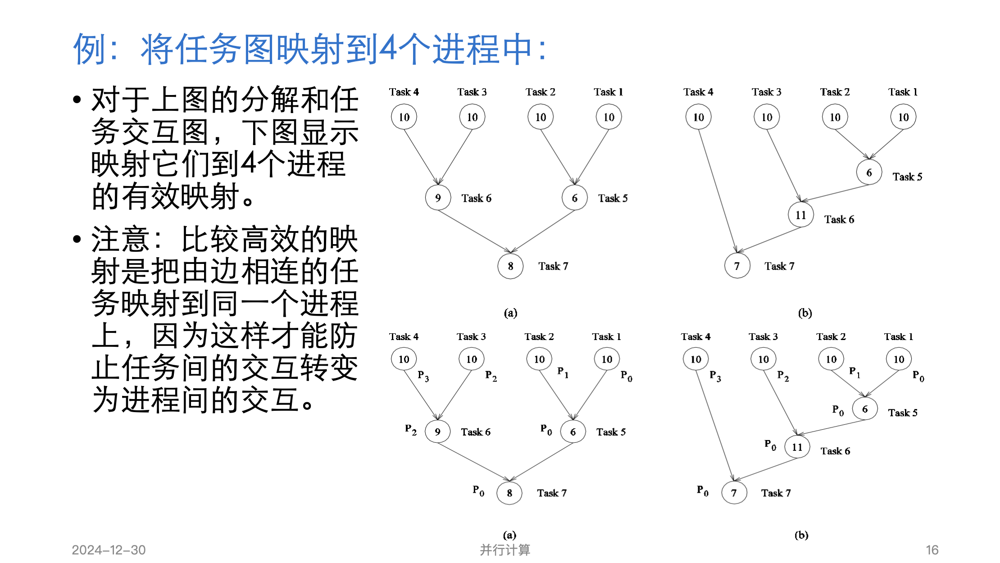
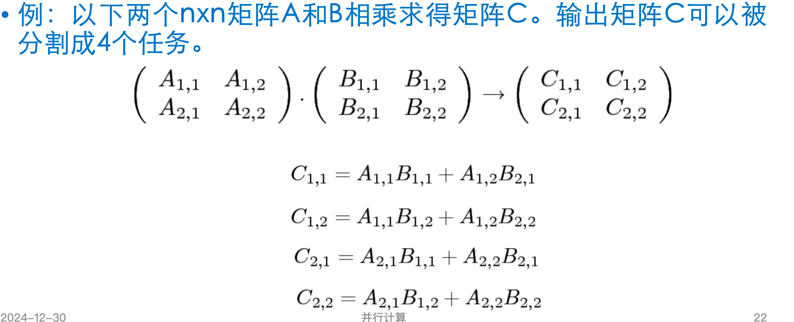
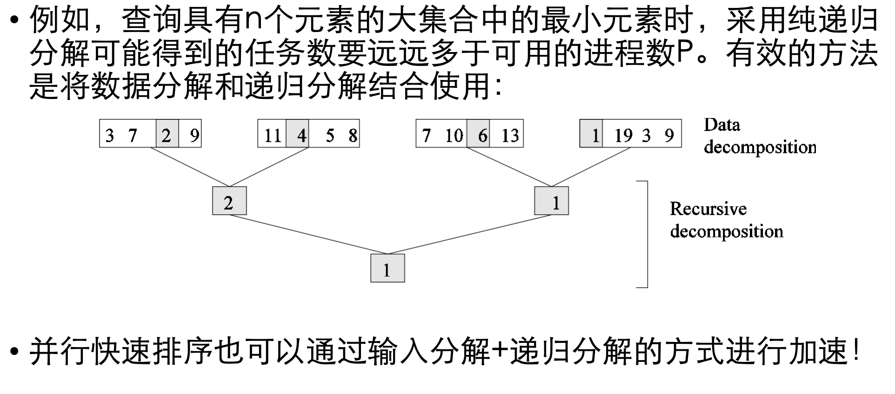

# 并行计算设计理念

### 分解与分配是并行计算的关键步骤

- 分解：将计算划分成许多小的计算；

- 分配：再把分解得到的小的计算分配到不同处理器中以便并行执行。

本文依据上述关键步骤, 大体上也分为 **分解** 与 **分配** 两个板块, 但在进入真正学习之前, 还请了解基础知识

## 一、基础知识

### 1. 粒度、并发度、交互关系

- ***粒度***: 体现了分解问题得到的任务数量和大小。

- ***最大并发度***: 任意时刻可同时执行的最大任务数称为最大并发度

- ***平均并发度***: 程序执行的整个过程中能并发运行的任务平均数,程序执行的整个过程中能并发运行的任务平均数

- ***任务依赖图***:  抽象表示任务间的依赖关系和任务的执行次序关系

- ***关键路径长度***: 依赖图中, 没有输入边的节点称为 **起始节点**，把没有输出边的节点称为 **终止节点**，任何一对起始节点和终止节点之间的最长有向路径就是 **关键路径**。关键路径上所有节点的权重之和称为 **关键路径长度**

- ***任务交互图***: 任务之间的交互方式可通过 **任务交互图** 来描述。

  - 任务交互图中节点代表任务，边连接彼此交互的任务

  - 任务交互图中的边集合通常是对应任务依赖图边集合的超集

- 任务间交互有无规则判定:

  - 有规则: 对于一个交互模式，如果 **有一些结构（空间结构）有利于其交互的高效实现**，那么这个模式被认为是有规则的。

  - 无规则: 如果一个交互模式中 **不包含规则模式** ，则被称为是无规则的。

- 任务间交互静态与动态性

  - 静态交互模式：对于每一个任务，它们之间的交互在预定的时间发生，并且在这些时间交互的任务集在算法执行之前是已知的。

  - 动态交互模式：在算法执行前，交互的时间或交互的任务集不与先确定

- 交互的单向与双向

  - 双向交互：**需要交互涉及的两个任务参与**，某一任务或任务子集所需要的数据或工作明显由另一任务或任务子集提供。
  - 单项交互：**交互可由参与某一个任务发起和完成，完成此交互并不会妨碍其他交互**。双向交互在编程时往往更加 **复杂**。

### 2. 进程与映射

分解中的任务数量超过可用处理元素的数量。因此，并行算法还必须提供 **任务到进程的映射**

**映射由任务依赖关系图和任务交互图确定。**

**任务依赖图** 可用于确保工作在任何时间点均等地分布在所有进程中（最小空闲和最佳负载平衡）

**任务交互图** 可用于确保进程需要与其他进程的交互最少（最少通信）

**好的映射**: 

1. 应把**相互独立的任务映射到不同的进程**以获取最大并发度; 
2. 应确保**可用进程来执行关键路径上的任务**，以使得任务变成可执行的时候总计算时间最短; 
3. **映射相互交互的任务到同一个进程**以便最小化进程间的交互

#### 静态映射和动态映射

- 静态映射:静态映射技术在 **算法执行前** 将任务分配给进程。
  - 以数据划分为基础的映射
  - 以任务划分为基础的映射
  - 分级映射(混合映射)
- 动态映射:动态映射技术在 **算法执行期间** 在进程间分配任务。
- 动态与静态的选择取决于以下几个因素：
  - 任务是否是动态产生
  - 任务大小是否已知
  - 与任务相关的数据大小任务间交互的特点
  - 并行编程模式等

## 二、 分解任务

#### 1. 递归分解

**流程**:

1. 递归划分子问题
2. 对独立子问题并发求解

#### 2. 数据分解

**流程**:

1. 对数据划分
2. 根据划分数据推导计算到任务的划分

数据分解形式多样,可分为:

- 输入划分
- 输出划分
- 输入输出划分
- 中间结果划分

例子如下:

> **拥有者-计算规则**
>
> 以划分输入或输出数据为基础的分解也常称为 **拥有者-计算** 规则。
>
> 规则思想：**每一个划分都执行涉及它拥有的数据的所有计算。**

### 3. 探测性分解

探测性分解中只要一个任务找到答案，其他未完成任务就可以终止。因此并行形式执行的操作既可以少于也可以多于串行算法执行的操作

### 4. 推测性分解

对于类似 switch 的语句, 在编译阶段并不可知其最终进入哪个分支, 因此需要推测分解任务

通常有两种方法：

- 保守方法：仅在保证没有依赖关系时并行执行；
- 乐观方法：即使它们可能是错误的，也调度和执行任务

保守的方法可能会产生很少的并发性，而乐观的方法可能需要在发生错误的情况下使用回滚机制

### 5. 混合分解

组合以上分解方法以获得更优效果

## 分配任务(映射)

### 负载平衡映射

让各个进程负载平衡，并使进程的空闲时间最小，并尽量减少进程间的交互

### 静态映射

#### 以数据划分为基础

##### 数组分配

- 块分配
  - 把数组分成小块,按照块划分, **负载不平衡**

- 循环分配

  - 块循环分配思想：把数组划分成比可用进程数更多的块，这样就可以采用循环的方式把划分的块（和相关任务）分配给进程，以便每个进程都能得到若干不相邻的独立的块。**解决负载不平衡**

  - 在二维块循环分配中，如果每一块只有一个元素，这种分配称为循环分配

##### 图划分

有许多运行在稀疏数据结构上的算法，这些算法的数据元素间的交互模式具有数据依赖，并且非常不规则,物理现象的数值模拟提供了这种计算类型的大量来源。

#### 以任务划分为基础

决定一个通用任务依赖图的最优映射是NP完全问题。但在特定情况下，人们通常可以找到简单的最优解或者可接受的近似解。

#### 分级映射

纯粹建立在任务依赖图上的映射可能会遇到负载不平衡，或并发度不够

### 动态映射

如果静态映射导致进程间负载高度不平衡，或任务依赖图本身就是动态的，就必须采用动态映射而排除静态映射。