## 并行计算范围

### 基础知识--并行平台

- **单指令流多数据流（SIMD）**: 单一控制部件向每个处理部件分派指令；
  - 控制语句会影响 SIMD 的性能
  - 只有一个全局控件
  - 设计研发周期长
- **多指令流多数据流（MIMD）**: 计算机的每个处理器都能够独立于其他处理器执行不同的程序；
  - 需要在每个处理器上安装程序和操作系统
- **单程序多数据（SPMD）**: 是MIMD模型的简单变形, 相当于将每一个MIMD中的计算指令用任务标识符指定的条件插入到一个大的if-else程序块中

:::info[SIMD vs MIMD]

SIMD 硬件要求少, 但 **研发要求高**, **不适合许多具有不规则特性的应用程序**,切需要为其设计硬件体系, **不够经济**

:::

### 基础知识--并行平台的数据通道/通信模型

:::info[任务见数据交换方式]

并行任务间有两种主要的数据交换方式：

- **访问共享数据空间**

- **交换消息**

:::

#### 1. 共享地址平台

共享地址空间是指并行平台支持一个**公共的数据空间，所有处理器都能访问该空间**。

处理器通过修改存储在共享地址空间的数据来实现交互。

:::info[一致性访问]

- **一致内存访问(UMA)**: 处理器访问系统中任何内存字（不包括cache）的时间都相同
- **非一致内存访问（NUMA）**: 访问某些内存字的时间长于其他内存字的访问时间

:::

:::tip[共享地址空间与共享内存计算机]

**共享内存计算机**，即内存在物理上被多个处理器共享的一种体系结构，每个处理器对任意的内存断有等同的访问权，属于UMA模型。**共享地址空间计算机**, 属于NUMA模型。

:::

#### 2. 消息传递平台

消息传递平台由p个处理节点构成，每个节点都有自己的独立地址空间。

运行在不同节点上的进程之间的交互必须用消息来完成，基本的消息交互操作是send和receive。

**在由p个节点的共享地址空间计算机上，很容易模拟含有同样节点个数的消息传递体系结构；反之，在消息传递计算机上模拟共享地址空间体系结构的代价很高。**

### 基础知识--并行平台的物理组织

#### 理想架构

***理想的并行随机访问计算机（PRAM）*** 包含p个处理器以及大小不受限制的全局内存，所有处理器同样可以访问该内存

然而允许并发就会带来同步问题,目前有几种协议解决同步问题:

- 共有，如果处理器**试图写的所有值都相同，则允许并发写。**
- 任意，**任一处理器可以进行写操作，而其余的处理器则不行。**
- 优先级，处理器按预定义的优先级列表排列、**最高优先级的处理器可以进行写操作而其他的处理器不能。**
- 求和，**所有量的总和被写入**（基于求和的写冲突解决模型能够扩展到任意由待写入量定义的相关操作符上)。

#### 互联网络

**互联网络** 提供多个处理节点之间或处理器与内存模块之间的数据传输的机制。

:::info[静态互联与动态互联网络]

- 静态互连网络：处理单元间有着固定连接的一类网络，在程序执行期间，这种点到点的链接保持不变；
- 动态网络(非直接)：用交换开关构成的，可按应用程序的要求动态地改变连接组态

:::

:::info[开关]

互接网络中的开关由**一组输入及输出端口**构成。

一个开关中**端口的总数**也称为该开关的**度**.

每个开关有两种联通方式:

- 直通式: 输入直接传送到输出处
- 跨接式: 跨接开关节点输入，然后再送出

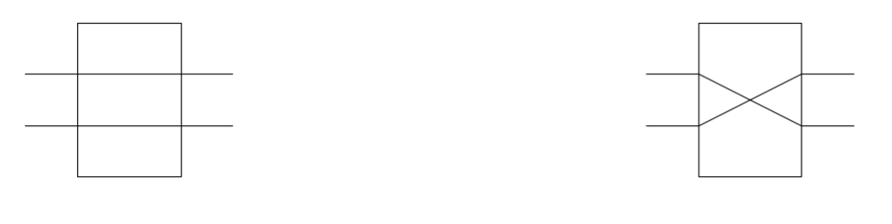

:::

#### 网络拓扑结构

互联网络中使用了各种各样的拓扑。这些结构用来实现成本、可拓展性和性能间的平衡

##### 1. 总线网络

简单,到任意节点距离为O(1)

瓶颈在于总线带宽

##### 2. 交叉开关

网格型,每个交叉点均为一个开关

##### 3. 多级网络

多级网络比总线网络在性能方面可扩展性更强，又比交叉开关网络在成本上可扩展性更强

节点分层,每一层都可以采用不同结构

##### 4. 多级omega网络

每一级网络处理 p 个输入, p 个输出, 网络级数为 log p

每一级都有一种互联模式, 例如 **完全混洗互联**

:::tip[完全混洗互联]

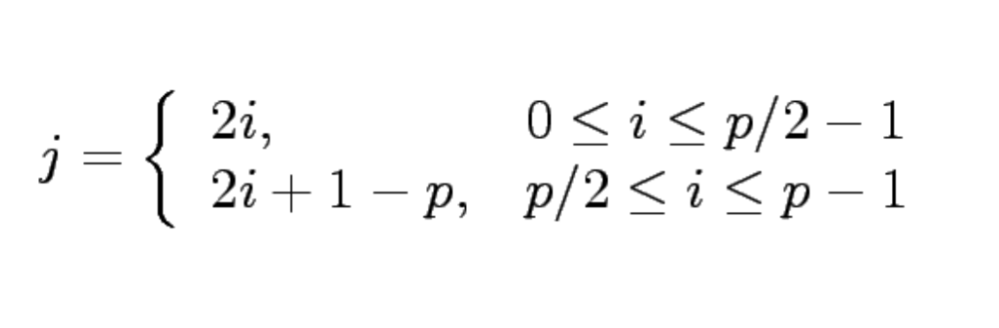

完全混洗互联中, 首节点和尾节点不参与混洗,仍指向相同位置

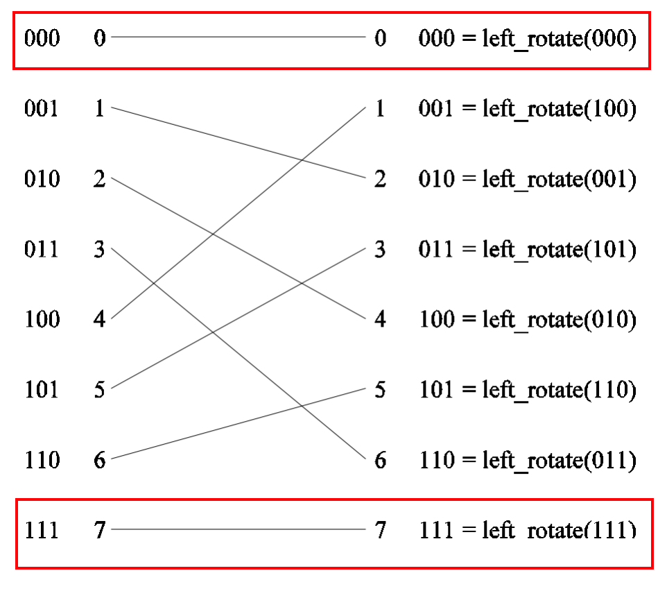

:::

经过完全混洗互联后,并非直接输出,而是两辆一组送到 2 * 2 **开关 **中

因此网络成本为 `log p * p / 2` , 其中 `log p` 为 网络深度, `p / 2` 为每一层开关个数

此成本低于完全交叉网络的 `p ^ 2`

###### 多级omega网络路由选择

- 设s为需要写数据到存储区t的处理器的二进制表示。
- 数据穿过链路到达第一个开关节点。
- 如果s和t的**最高有效位相同**，那么开关就会按**直通**式方式进行数据选路;如果**最高有效位不同**，则以**跨接**方式进行数据选路。
- 在下一个开关级，再使用下一个最高有效位来重复同样的方案。

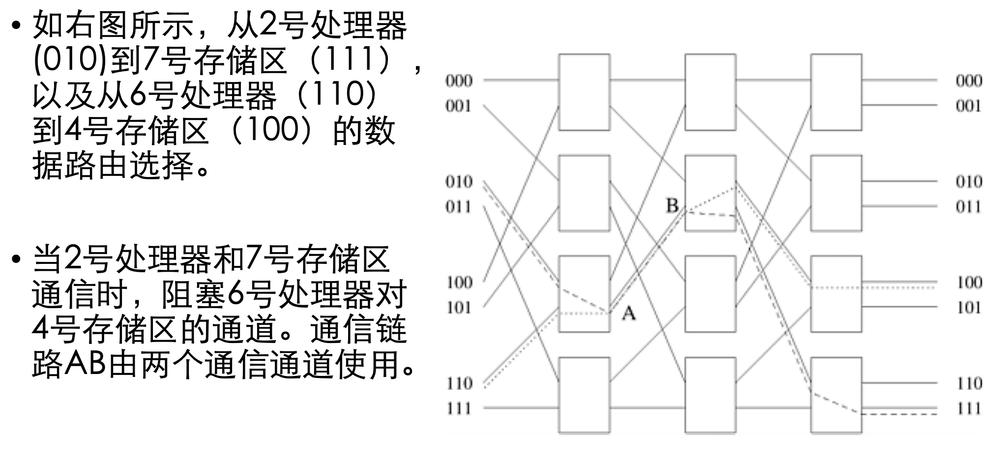

##### 5. 线性阵列、格网、k-d网

网络中链路过多, 选择稀疏网构造并行计算机

**线性阵列** 拓展到二维及为 **格网**

再拓展到更高维则成为 **k-d网**

:::info[k-d网]

K-d格网指的是一种拓扑结构，它有d维，每一维上有k个节点

线性阵列构成k-d网格的一个极端；

另一种成为超立方体的拓扑结构构成另一个极端，即**在每个维度上有两个节点。**

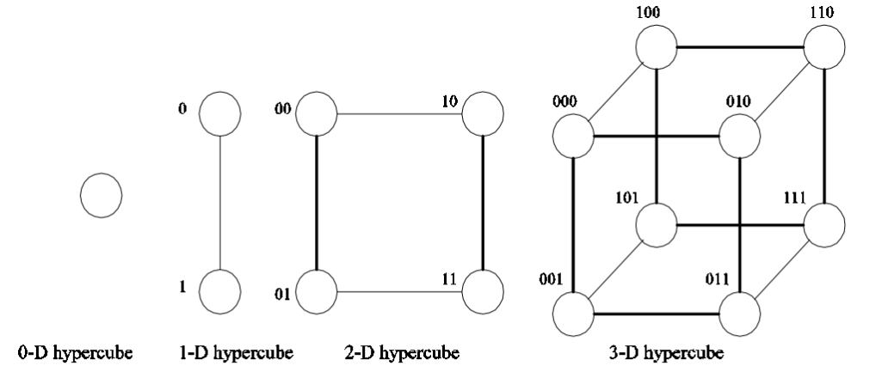

**网中节点最大距离为 `log p`, 每个节点有 `log p `个邻居**

:::

##### 6. 基于树的网络

网络中任意一对节点间只存在一条通路

线性阵列和星形连接网络都是树网格的特例

**静态网络在树的每个节点都有处理器;**

**动态树网络中，中间层的节点位交换节点，叶子节点是处理器**

:::info[胖树]

由于树网络中越靠上层对于带宽要求越大,因此可以通过增加通信链路，以及增加更接近根节点的交换节点的个数

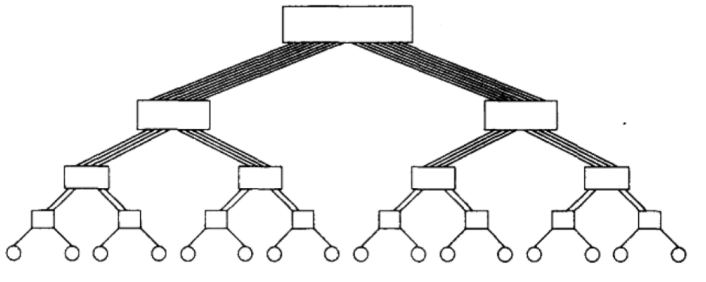

:::

#### 网络评价

##### 静态网络

- 网络直径：网络中**任意两个处理节点之间的最长距离**。两个处理节点间的距离定义为它们间的最短路径（用链路数目表示)。
- 连通性：连通性是网络中**任意两个节点间路径多重性**的度量。
- 弧连通性：将一个网络分为两个不连通网络需要删去的最少弧数目。
- 对分宽度：把网络分为两个相等网络时，必须删去的最小通信链路的数目。
- 通道宽度：能够通过连接两个节点链路同时进行通信的位数。
- 对分带宽（或截面带宽）：对分网络任何两半之间允许的最小通信量，它是对分宽度和通道宽度的乘积。成本：网络中所需的通信链路数量。

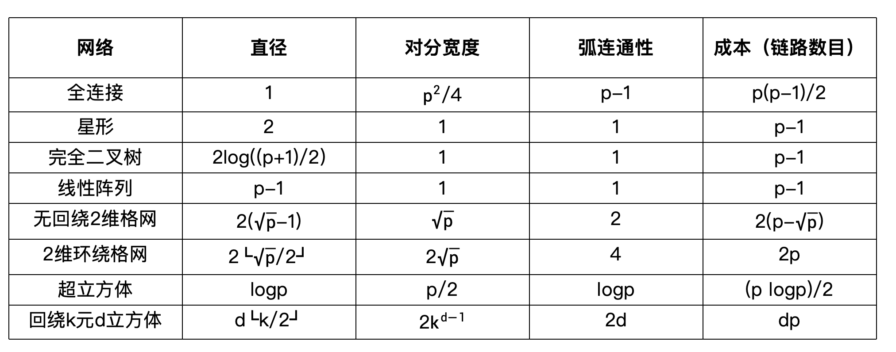

##### 动态网络

由于动态网络中存在开关的概念, 因此需要将开关损耗也考虑在内,新增 **节点连通性** 指标

- 节点连通性：把网络分成两个部分必须删去的最小节点数目。这里只考虑开关节点（与考虑所有节点不同)。

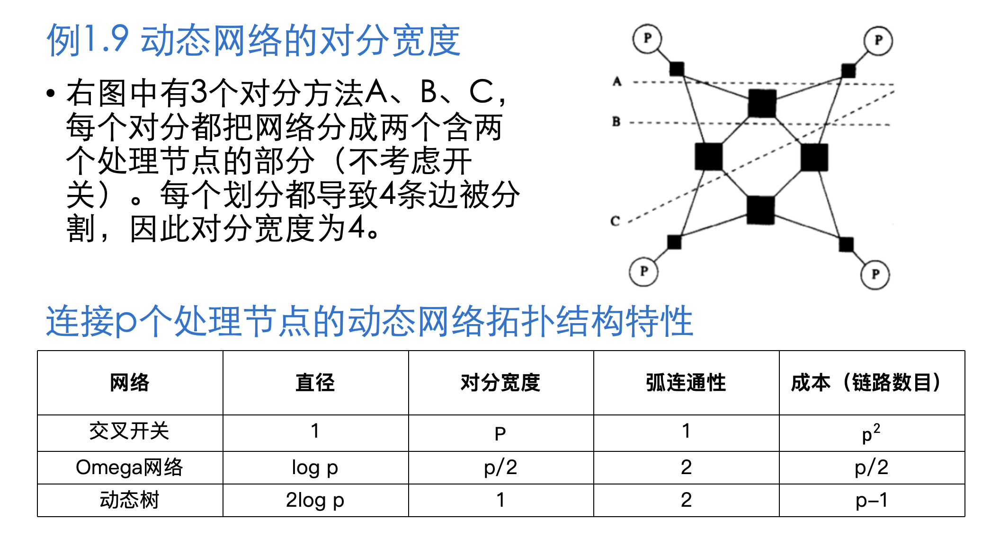

#### 高速缓存一致性

该问题仍属于同步问题,目前依靠协议解决, 现存 **更新** 以及 **无效** 协议

- **更新协议**: 无论何时写入一个数据项，它在系统中的所有副本都被更新。因此，如果某处理器只读了一次数据项，就再也不使用它，那么，其他处理器对该数据项的更新将会造成多余的开销。
- **更新协议**和**无效协议**的性能均会受到**假共享（false sharing）**的影响。
- 当前的高速缓存一致性计算机 **通常依靠无效协议。**

:::info[假共享]

假共享是指不同的处理器更新相同高速缓存行（cache-line）中不同部分的情况。

假共享会造成某一高速缓存行中的数据在不同的处理器间像打乒乓球一样传来传去。

:::

##### 无效协议

每个数据副本都关联一个状态（shared, invalid, dirty）

当某处理器对变量做 **存储操作** 时, 该变量的所有副本都被标记为无效(invalid)。并把自己拥有的变量标记为已修改或脏（dirty)

若另一处理器执行 **加载操作**, 将变量标记为 dirty 的处理器会对请求提供服务, 并将全局副本更新, 数据重新变回 共享(shared) 状态

## 基础知识-进程-处理器映射

映射过程中，有三个参数很重要。

- 第一，E中有可能不止一条边映射到E^′的一条边上。映射到E^′的任意边上的边数最大值称为**映射拥塞度(congestion)**。
- 第二，E中的一条边可能被映射到E'中多个相邻的边上。这一点也很重要，因为在相应链路的通信必须穿过不止一条链路，可能导致网络拥塞。E中的任意一条边能映射到E^′中的最大链路数目，称为**映射膨胀度( dilation)**。
- 第三，集合V和V^′可能包含不同数量的顶点。在这种情况下，V中的节点和V^′中不止一个节点相对应。集合V^′中节点的数目和集合V中节点数目之比称为映射扩充度。

:::info[映射膨胀度 & 映射拥塞度]

**映射拥塞度**: 映射到E^′的任意边上的边数最大值

**映射膨胀度**: E中的任意一条边能映射到E^′中的最大链路数目

:::

## 并行计算优化

:::info[并行计算的两个重要部分]

- 表达并行任务的方法 === 控制结构
- 指定任务间相互作用的机制 === 通信模型

:::

传统意义上的串行计算机主要由 **处理器、内存和数据通道** 三个部件组成

### 优化处理器延迟

改进设计理念: 一个时钟周期内执行多个指令

#### 1. 流水线与超标量

单流水线的速度最终受到流水线中最大原子任务的限制。

**超标量**: 在CPU中有一条以上的流水线，并且每时钟周期内可以完成一条以上的指令

***超标量效率***:

- **垂直浪费**: 某一周期中执行部件没有指令发送；
- **水平浪费**: 一个周期中只用到部分部件；

#### 2. 超长指令字处理器(VLIW)

超标量调度器的**硬件成本和复杂性**是处理器设计中的主要瓶颈。

为解决这个问题，VLIW处理器依靠编译分析技术来**识别和捆绑可以同时执行的指令**。

这些指令被调度和打包在一起，因此成为了长度超长的指令字。

这样做的好处是硬件设计简单

### 优化内存延迟

:::info[内存系统的两个性能指标]

- ***延迟***: 从处理内存指令请求到处理器获取数据期间所需的时间。
- ***带宽***: 数据从内存送到处理器的速度。

:::

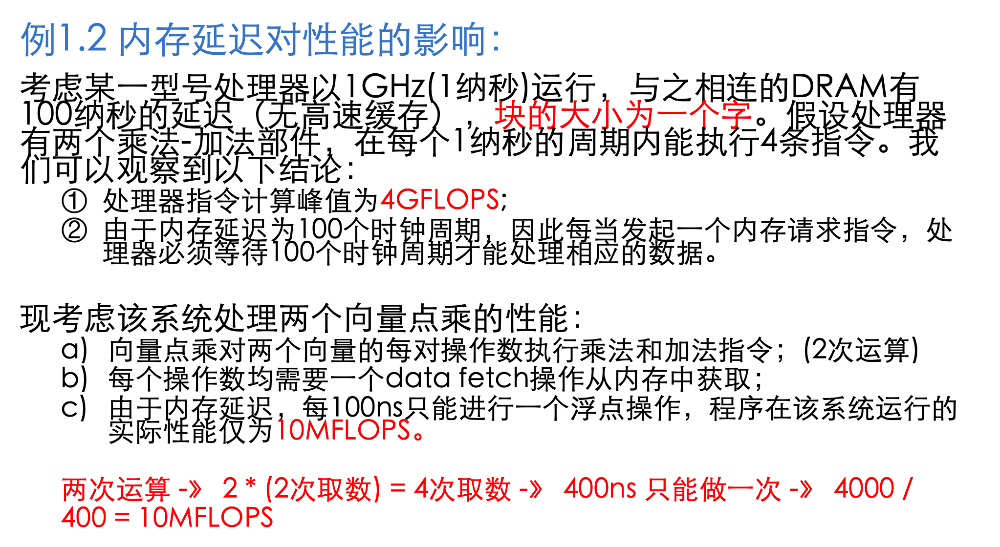

#### 1. 设立高速缓存(cache)

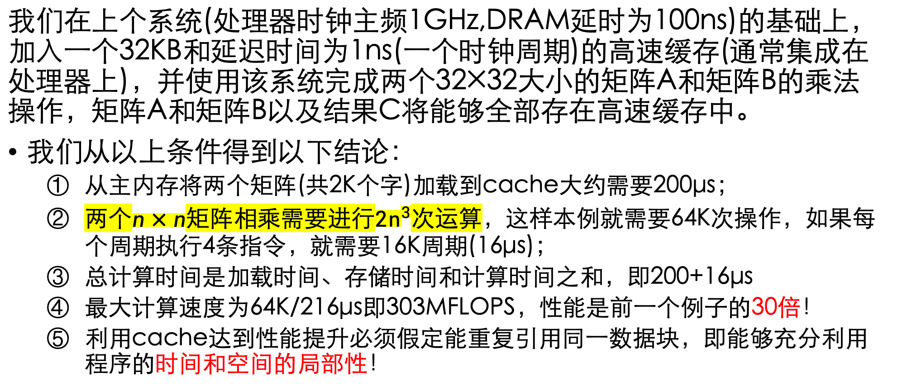

#### 2. 增加内存带宽

增加块大小,使得取数操作减少,减少与 DRAM 交互,减少等待, 从而提高效率

#### 3. 消除跨距访问

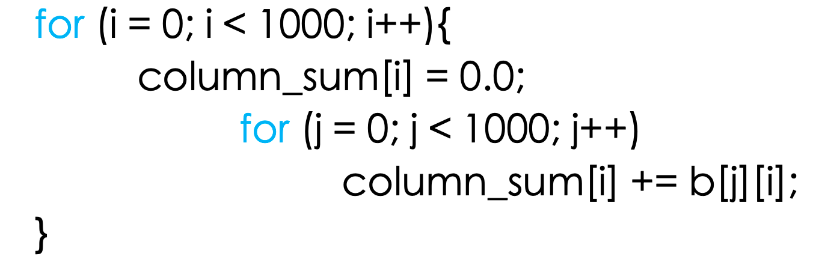

该例子中,每次只读取 b 一行中的一个数, 会导致 cache 失效, 从而每次都需要直接与 DRAM 交互, 产生 **跨距访问**

该问题本质上与高速缓存相同

#### 4. 多线程躲避延迟

任务划分,这在第二章会详细解释, 本章节中简单理解为将互不影响的部分分到不同线程中并行执行,从而减少空闲时间

#### 5. 预取

数据载入操作提前, 即使发生 cache miss, 在真正需要使用时也能准备好

缺点: 如果数据项在载入和使用之间的时间间隔内被覆盖，就必须重新发出数据载入指令，从而影响程序性能。

### 优化通信成本

两个节点间传送一条消息所花的时间是准备传送消息所花的时间及消息从网络中传送到目的地所花时间之和. 有以下主要参数：

1. **启动时间(ts)**：在发送节点和接收节点处理消息所花费的时间。它包括消息的准备、执行路由算法等时间。
2. **每站时间(th)**：消息在单个节点上的延迟时间。该时间受到网络延时、开关或路由延时的影响。
3. **每字传送时间(tw)**：如果通道带宽是r个字每秒，那么每个字要花tw=1/r秒穿过链路。它包括网络开销以及缓冲开销。

##### 1. 存储转发

消息穿过有多个链路的路径时，路径上的每个中间节点接收和存储完整的消息后，就把消息转发给下一个节点。

**将m个字的消息通过l个通讯链路发送到目的节点的总通讯时间** 可用上述参数表示为: `ts + th * l + tw * m * l`

由于每站时间 `th` 很小,因此可以忽略不计, 简化为: `ts + tw * m * l`

##### 2. 包路由选择

把大的消息块分割成多个包,在网络中以流水线的方式处理这些包

这样可以省去等待包传输的时间, 因此总时间优化为: `ts + th * l + tw * m`

##### 3. 直通路由选择

直通路由选择在包路由选择的基础上做了以下改动：

- 消息被分成固定大小的单元，称为流量控制数字(flow control digit)或数据片(flit)；
- **强制所有的数据片走同样的路径**。

相较于包路由选择，直通路由选择有以下**优势**：

- Flit比包小得多；
- 无每个包的传送路由选择信息开销；
- 无需顺序信息；
- 在并行计算机互连网络中（错误率极低），可采用错误检测机制取代开销很大的错误校正方案

在直通路由选择中,消息传递还可优化:

1. 大块通信：把多个小消息集中成一个大消息，这样就不用发送每条小消息和为每条消息花费开始成本ts；
2. 减少数据的大小：减少每字传送时间的开销；
3. 减少数据传送的距离：减少消息必须通过的站的数目。

#### 互联网络路由选择

根据路径长短的方式划分：

- 最小化路由选择；
- 非最小化路由选择。

根据**确定性**的方式划分：

- 确定性路由选择；
- XY路由选择 -》二维格网
  - 消息首先沿X维出发，直到到达目标节点的列，再沿Y维达到目的节点
- E立方体路由选择 -〉 超立方体网络
  - 与XY路由选择方案类似：在d维的超立方网络中，先从第一维出发，找到目标节点第一维相同的位置，再从第二维出发，直到在第d维到达目标节点

- 自适应路由选择