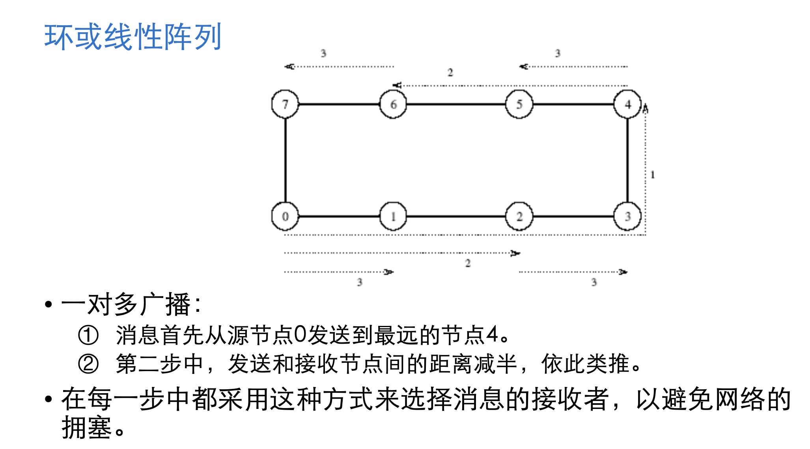
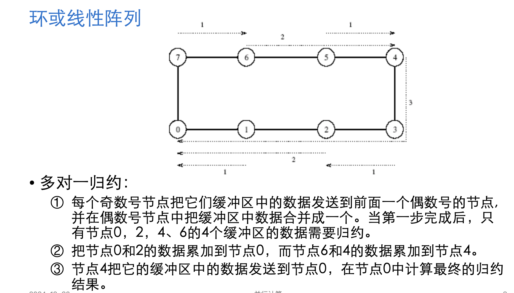
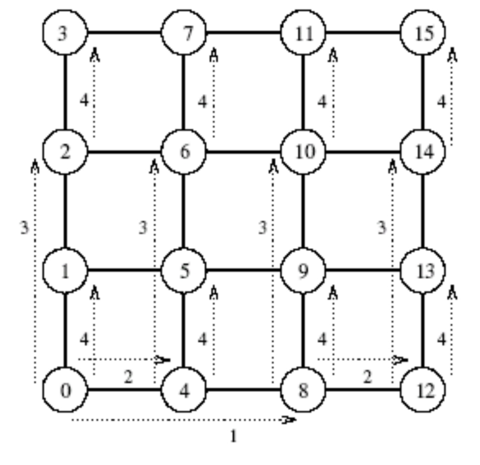
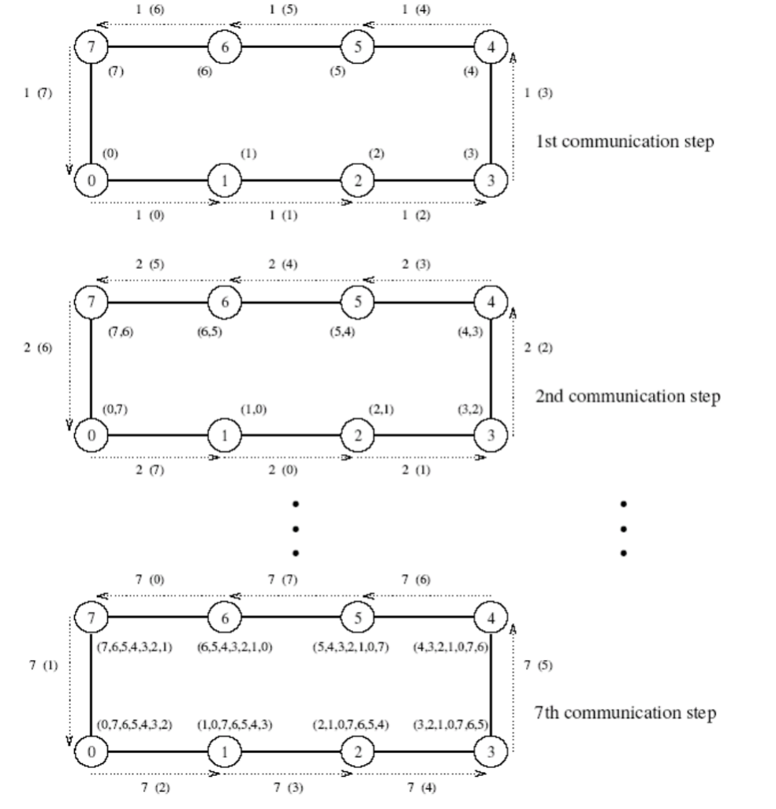
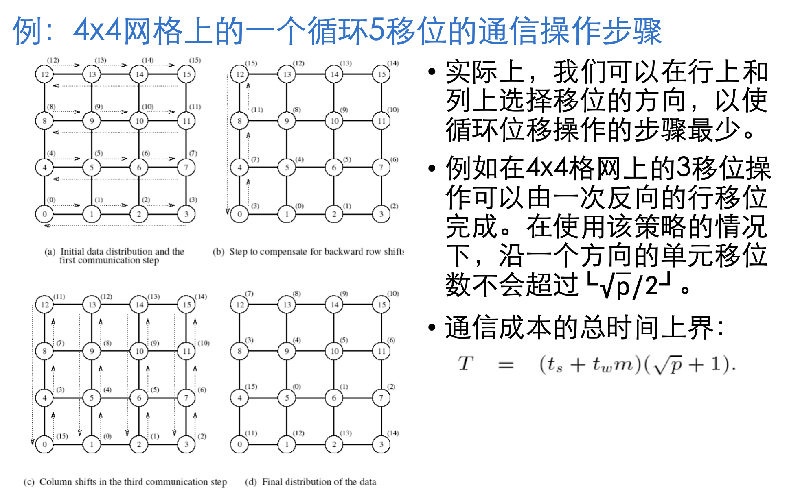

# MPI 第三章复习提纲
## 一对多广播

一个进程发送相同的数据给其他所有的进程或其他所有进程的子集

**多对一归约**(一对多广播的对偶)：在多对一归约操作中，p个参与进程的每一个都有一个缓冲区M，它包含m个字。来自所有进程的数据通过一个相关的操作符组合起来，并被累加到一个目标进程中一个m字的缓冲区中

:::info[归约]

归约操作可以用来求一些数字集的和、乘积、最大值和最小值：累加结果M中的第i个字是每个原缓冲区中第i个字的和、乘积、最大值和最小值。

:::

### 实现方法

可利用对偶性（一对多广播的对偶）实现：多对一归约可以先进行多对多归约（多对多广播的对偶），再进行收集操作（散发的对偶）

- 简单实现: 源节点向其余节点都发送消息, **简单但效率低下**
- 递归加倍：**源进程首先发送消息给另外一个进程。然后，这两个进程可以同时发送消息给还在等待消息的其他两个进程**。继续这一过程，直到所有进程都收到了数据，这样消息可以在**log p**步广播完毕

#### 1. 环或线形队列

#### 2. 网格

可以把一个具有p个节点的方形格网的行或者列看作一个有√p节点的线性阵列。

一个线性阵列的通信操作可以在一个格网中分两个阶段来执行。

- 第一阶段，可以将格网中的行看作是线性阵列,将操作沿着一行或所有行进行。(除去每一行末尾节点)
- 第二阶段，再对列进行同样的操作。

#### 3. 超立方体

超立方具有2d个节点，那么可以将其看作是一个d维的格网，每个维度上有两个节点。因此格网算法能扩展到超立方体，在超立方体中的通信需要分d步来进行，每一步对应于每一维。

#### 4. 平衡二叉树

一对多广播的超立方算法可以自然地映射到平衡二叉树；

在平衡二叉树中，每一个叶子是处理节点，每一个中间节点是开关单元。

## 多对多广播

### 实现方法

1. 每个节点同时向它的一个邻居节点广播数据；
2. 在后面的步骤中，将每个节点同时向其他邻居节点转发从上一步骤中接受到的邻居节点的数据。
3. 整个算法在p-1步完成

#### 1. 环型队列

#### 2. 网格

1. 第一阶段，格网中的每一行执行一次线性阵列形式的多对多广播。在这一阶段里，每个节点从它们各自所属的具有√p个节点的行上收集√p个消息。每个节点把这些收集到的消息聚合成一个大小为m √p的消息，然后进行算法的第二通信阶段。
2. 第二通信阶段按列对合并后的消息执行多对多广播。当这一阶段完成时，每个节点获得p个m字的数据、这些数据原来驻留在不同的节点上。

## 全归约与前缀和

- 全归约( all-reduce）操作等同于先进行一个多对一归约，再进行一个一对多广播。这个操作与多对多归约不同，多对多归约是p个多对一归约同时进行，并且每个操作都有不同的目标节点。使用多对多广播通信模式，可以更快地进行全归约操作
- 前缀和: 原始数字序列为（3，1，4，0，2），那么前缀和序列为（3，4，8，8，10）。

## 散发和收集

- 散发(scatter)：单个节点发送一个大小为m的唯一消息给每一个其他的节点。发散操作的源节点从p个独自消息开始，每个消息将发给不同的节点。
- 收集(gather)：一个节点从其他各个节点那里处收集消息。收集操作并不涉及数据的组合与归约。

## 多对多私自通信

每个节点给其他的每个节点发送一个大小为m的不同消息。每个节点都发送不同的消息给不同的节点！

#### 环上的多对多私自通信

1. 开始时每个节点把它们所有的数据作为一个合并的大小为m(p-1)的消息，发送给它们的一个邻居节点。
2. 随后，每个节点从接收到的数据中提取属于自身的数据，然后将剩下的p-2块m字大小的数据转发到下一个邻居节点上。
3. 重复步骤2，直至所有数据都发送到相应的节点上。

## 循环位移

循环q移位(circular q-shift）定义:在一个p节点的系统中，节点i发送一个数据包给节点 (i+q) mod p，其中(0 < q < p )。

