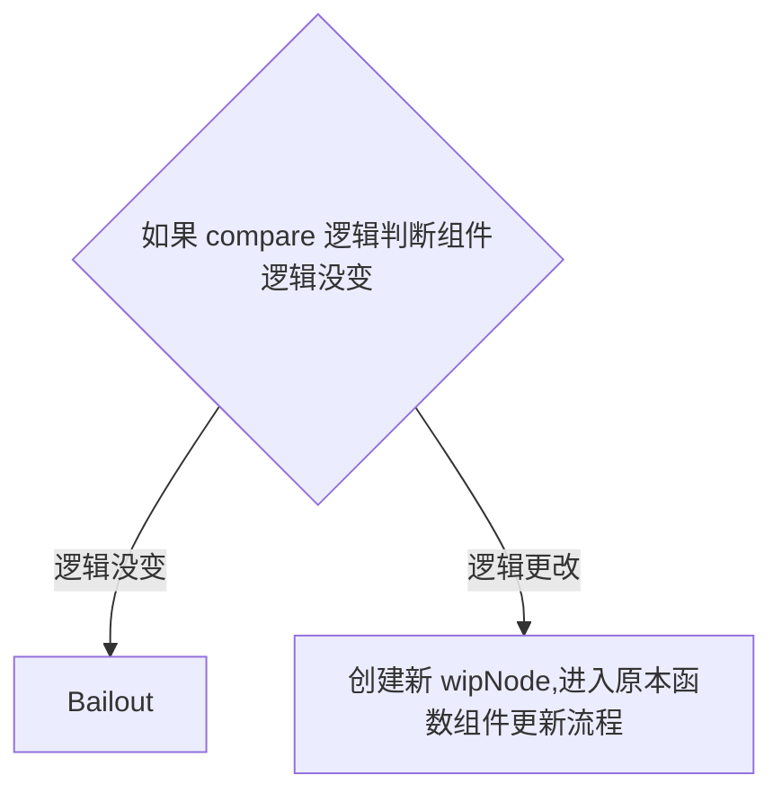
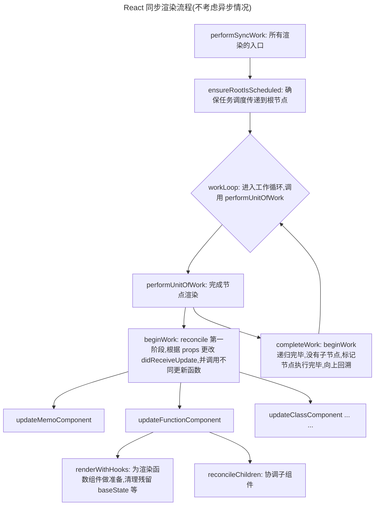

# React 工作流
> 本篇文章仅讨论 React 触发构建以及更新 VDOM 的逻辑
> 并不会详细讲解 diff 算法
> 有关 diff 的讲解位于 [React-Reconcile](./React-Reconcile.md)

## React 渲染流程
作为一个开发者,得以窥探框架渲染过程的唯一契机就是性能监控面板

我也很推荐在阅读源码前去翻看性能监控,查看框架到底做了哪些事情

这比无头苍蝇的死磕源码要高效的多

这是我观察 React 执行过程的流程:

1. 首先随便打开一个项目（用`dev`模式，生产模式会被打包改名，不好辨认）

2. `F12`打开控制台，打开【性能】面板

3. 随便与页面交互一下，并用【性能】记录

4. 得到结果大致如下：

   

   其中绿色部分就是这个板块要研究的`React`渲染流程

   从图中我们可以提取到渲染流程如下：

   

   那我们顺着它往下走,从 `performSyncWorkOnRoot` 入手,观察 React 究竟干了什么 

## performSyncWorkOnRoot

源码如下：

```tsx
function performSyncWorkOnRoot(root: FiberRoot, lanes: Lanes) {
  // This is the entry point for synchronous tasks that don't go
  // through Scheduler.
  const didFlushPassiveEffects = flushPassiveEffects();
  if (didFlushPassiveEffects) {
    // If passive effects were flushed, exit to the outer work loop in the root
    // scheduler, so we can recompute the priority.
    return null;
  }
  if (enableProfilerTimer && enableProfilerNestedUpdatePhase) {
    syncNestedUpdateFlag();
  }
  const forceSync = true;
  performWorkOnRoot(root, lanes, forceSync);
}

```

这里通过`forceSync`强制`performWorkOnRoot`以同步方式工作

有同步，就有异步，而且通过这段代码就可以看出，在`React`中，更提倡的其实是异步的任务处理

而异步的任务处理，在`React`中，被称为`Concurrent`模式，与这里的区别在于`Scheduler`会介入，给任务排优先级，这个优先级被称为`lanes`，这在源码中会经常遇见，但是我们现在先不用管，先顺着较为简单的`sync`模式一步步摸索下去

> 这里卖个关子
>
> ```tsx
> const didFlushPassiveEffects = flushPassiveEffects();
> ```
>
> 这一行我们先不做解释，之后慢慢掰扯掰扯

我们看看`performWorkOnRoot`干了什么

## performWorkOnRoot

我把代码简化了一下，大概分为以下几个阶段：

```tsx
// ...

let exitStatus = shouldTimeSlice
    ? renderRootConcurrent(root, lanes)
    : renderRootSync(root, lanes, true);

do {
        // 通过 exitStatus 检查 render 执行状态并决定应该继续还是结束
} while(true)

ensureRootIsScheduled();

```

其中`shouldTimeSlice`就是是否应该启用`Concurrent`模式开启时间切片的意思

接着进入到渲染函数`renderRoot`,最后`ensureRootIsScheduled`

`renderRootSync` 很好判断,即为渲染的主入口,然而 `ensureRootIsScheduled` 就没有这么容易揣测
从名称看,是确保 root 被调度,那么这里的 root 指代的是什么呢?为什么需要这个函数呢? 我们带着问题继续往下查看

## ensureRootIsScheduled
简化后代码如下:
```jsx
  // 创建 root 列表 
  if (root === lastScheduledRoot || root.next !== null) {
    // Fast path. This root is already scheduled.
    // 什么都不做,即复用当前已存在调度
  } else {
    if (lastScheduledRoot === null) {
      firstScheduledRoot = lastScheduledRoot = root;
    } else {
      lastScheduledRoot.next = root;
      lastScheduledRoot = root;
    }
  }
  // 如果不允许微任务调度
  // 调度 immediate 调度
  if (__DEV__ && ReactSharedInternals.actQueue !== null) {
    // We're inside an `act` scope.
    if (!didScheduleMicrotask_act) {
      didScheduleMicrotask_act = true;
      scheduleImmediateTask(processRootScheduleInMicrotask);
    }
  } else {
    if (!didScheduleMicrotask) {
      didScheduleMicrotask = true;
      scheduleImmediateTask(processRootScheduleInMicrotask);
    }
  }
  // 如果允许微任务调度就调度微任务
  if (!enableDeferRootSchedulingToMicrotask) {
    scheduleTaskForRootDuringMicrotask(root, now());
  }
```
该函数功能很简单, 会维护一个**root 列表**, 并为列表中任务增加调度.

那么这也从侧面说明, 该函数中的 root 不可能为整棵fiber树的root

实际上在这里,root就代表一个树节点, **react 每次调度树时都需要检查节点是否已经被调度, 如果有任务调度存在,则复用当前调度**

调度又分为`scheduleTaskForRootDuringMicrotask` 以及 `scheduleImmediateTask` 为具体调度函数:

在同步模式下,二者均只给 root 打上 `syncLane`

`schduleTaskForRootDuringMicrotask` 主要源码如下:
```jsx
  if (
    // 如果 lane 为同步
    // 并且未做 prerender
    includesSyncLane(nextLanes) &&
    !(enableSiblingPrerendering && checkIfRootIsPrerendering(root, nextLanes))
  ) {
    // 同步任务借助微任务执行
    // 而微任务会在一帧内被清空
    // 即任务一定会在当前帧执行完毕
    // 所以不需要 react 追踪执行状态
    // 也就不需要 scheduleCallback
    if (existingCallbackNode !== null) {
      cancelCallback(existingCallbackNode);
    }
    root.callbackPriority = SyncLane;
    root.callbackNode = null;
    return SyncLane;
  }
```
那么为什么需要 `ensureRootIsScheduled` 呢?
或者说这个函数有什么作用吗?

Andrew 的 commit 注释如下:
> When React receives new input (via `setState`, a Suspense promise
resolution, and so on), it needs to ensure there's a rendering task
associated with the update. Most of this happens
`ensureRootIsScheduled`.
> If a single event contains multiple updates, we end up running the
scheduling code once per update. But this is wasteful because we really
only need to run it once, at the end of the event (or in the case of
flushSync, at the end of the scope function's execution).
> So this PR moves the scheduling logic to happen in a microtask instead.
In some cases, we will force it run earlier than that, like for
`flushSync`, but since updates are batched by default, it will almost
always happen in the microtask. Even for discrete updates.

> In production, this should have no observable behavior difference. In a
testing environment that uses `act`, this should also not have a
behavior difference because React will push these tasks to an internal
`act` queue.

> However, tests that do not use `act` and do not simulate an actual
production environment (like an e2e test) may be affected. For example,
before this change, if a test were to call `setState` outside of `act`
and then immediately call `jest.runAllTimers()`, the update would be
synchronously applied. After this change, that will no longer work
because the rendering task (a timer, in this case) isn't scheduled until
after the microtask queue has run.
> I don't expect this to be an issue in practice because most people do
not write their tests this way. They either use `act`, or they write
e2e-style tests.
> The biggest exception has been... our own internal test suite. Until
recently, many of our tests were written in a way that accidentally
relied on the updates being scheduled synchronously. Over the past few
weeks, @tyao1 and I have gradually converted the test suite to use a new
set of testing helpers that are resilient to this implementation detail.
(There are also some old Relay tests that were written in the style of
React's internal test suite. Those will need to be fixed, too.)
> The larger motivation behind this change, aside from a minor performance
improvement, is we intend to use this new microtask to perform
additional logic that doesn't yet exist. Like inferring the priority of
a custom event.

翻译过来大概意思就是在 React 中有多种方式会触发组件更新，例如通过 setState、Suspense 的 promise 解析等。每当发生这些更新时，React 需要确保有一个 渲染任务 与更新相关联，这个渲染任务最终会被执行。ensureRootIsScheduled 是用来保证这个渲染任务被正确调度的函数。

原来的架构中,多个更新任务的重复调度：如果一个事件（例如用户点击、输入等）包含多个状态更新，React 会针对每次更新都执行一次调度逻辑。这是浪费的，因为实际上我们只需要在事件的结束时（或 flushSync 调用结束时）执行一次调度任务，而不是每个 setState 调用都触发一次调度。

这次采用 microtask 调用,确保在每个渲染任务的末尾调用更新即可,提高性能

不可谓不妙啊

理解了这个函数的作用后,我们继续看看 renderRootSync 这个主要函数入口

## renderRootSync

源码较长，但可大致分为如下部分:

```tsx
  // 栈帧处理,刷新栈帧
  if (workInProgressRoot !== root || workInProgressRootRenderLanes !== lanes) {
    if (enableUpdaterTracking) {
      if (isDevToolsPresent) {
        const memoizedUpdaters = root.memoizedUpdaters;
        if (memoizedUpdaters.size > 0) {
          restorePendingUpdaters(root, workInProgressRootRenderLanes);
          memoizedUpdaters.clear();
        }
        movePendingFibersToMemoized(root, lanes);
      }
    }

    workInProgressTransitions = getTransitionsForLanes(root, lanes);
    prepareFreshStack(root, lanes);
  }
  
  // wip 渲染挂起处理
  // 省略 switch 部分,不是本文重点
  
  // workloop执行，可能会被挂起
  workloopSync();
  // ...
  
  
  // 正常执行完毕
  if (workInProgress !== null) {
    // 渲染被挂起,保留当前渲染进度
   } else {
        // 正常情况下渲染完毕,清空 wip 树
      workInProgressRoot = null;
      workInProgressRootRenderLanes = NoLanes;

      // It's safe to process the queue now that the render phase is complete.
      finishQueueingConcurrentUpdates();
    }
```
实际上,主体逻辑只有一行: `workLoop`

那继续顺藤摸瓜, workLoop 在干什么呢?

## workloop/performUnitOfWork

`workloop`很纯粹，循环`workInProgress`应用更改

```tsx
function workLoopSync() {
  // Perform work without checking if we need to yield between fiber.
  while (workInProgress !== null) {
    performUnitOfWork(workInProgress);
  }
}
```

`performUnitOfWork`中可以看到两个在[前备知识](../intro.md)中熟悉的身影:`beginWork`和`completeWork`

从此处开始，更新粒度深入为`fiberNode`级别

```tsx
  // current 树上节点
  // 通过 wip 的 alternate 指向
  const current = unitOfWork.alternate;

  let next;
  // 除去 dev 以及 profiler 逻辑
  // 主体逻辑仅有一行
  // 对当前节点做 beginWork
  // beginWork 返回下一个节点
  next = beginWork(current, unitOfWork, entangledRenderLanes);

  if (!disableStringRefs) {
    resetCurrentFiber();
  }
  unitOfWork.memoizedProps = unitOfWork.pendingProps;
  if (next === null) {
    // 如果后续没有节点,代表本节点的 unitWork 完成
    // 调用 completeWork 进入下一阶段
    completeUnitOfWork(unitOfWork);
  } else {
    workInProgress = next;
  }
```
那么 `beginWork`又在干什么呢
咱们继续向下深挖

## beginWork
```tsx
if (current !== null) {
    const oldProps = current.memoizedProps;
    const newProps = workInProgress.pendingProps;
    // 通过 didReceiveUpdate 确定组件是否需要更新
    // didReceiveUpdate 直接决定了组件是否需要重新渲染
    if (
      // 浅比较 props
      oldProps !== newProps ||
      hasLegacyContextChanged() ||
      // Force a re-render if the implementation changed due to hot reload:
      (__DEV__ ? workInProgress.type !== current.type : false)
    ) {
      // props 不同, 代表需要更新了
      didReceiveUpdate = true;
    } else {
      // 如果新旧 props 相同, 则检查是否已经被 scheduler 调度了
      // 如果被调度,则退出
      // 如果没被调度,则什么都不做
      // legacy mode 不做讨论
      const hasScheduledUpdateOrContext = checkScheduledUpdateOrContext(
        current,
        renderLanes,
      );
      if (
        !hasScheduledUpdateOrContext &&
        // If this is the second pass of an error or suspense boundary, there
        // may not be work scheduled on `current`, so we check for this flag.
        (workInProgress.flags & DidCapture) === NoFlags
      ) {
        // No pending updates or context. Bail out now.
        didReceiveUpdate = false;
        return attemptEarlyBailoutIfNoScheduledUpdate(
          current,
          workInProgress,
          renderLanes,
        );
      }
      if ((current.flags & ForceUpdateForLegacySuspense) !== NoFlags) {
        // This is a special case that only exists for legacy mode.
        // See https://github.com/facebook/react/pull/19216.
        didReceiveUpdate = true;
      } else {
        // An update was scheduled on this fiber, but there are no new props
        // nor legacy context. Set this to false. If an update queue or context
        // consumer produces a changed value, it will set this to true. Otherwise,
        // the component will assume the children have not changed and bail out.
        didReceiveUpdate = false;
      }
    }
  } else {
    // 创建 node 逻辑
    didReceiveUpdate = false;

    if (getIsHydrating() && isForkedChild(workInProgress)) {
      const slotIndex = workInProgress.index;
      const numberOfForks = getForksAtLevel(workInProgress);
      pushTreeId(workInProgress, numberOfForks, slotIndex);
    }
  }

  // 清除 wip 优先级
  workInProgress.lanes = NoLanes;

  // 根据 tag 更新组件
  switch (workInProgress.tag) {
    case LazyComponent: {
      const elementType = workInProgress.elementType;
      return mountLazyComponent(
        current,
        workInProgress,
        elementType,
        renderLanes,
      );
    }
    case FunctionComponent: {
      const Component = workInProgress.type;
      const unresolvedProps = workInProgress.pendingProps;
      const resolvedProps =
        disableDefaultPropsExceptForClasses ||
        workInProgress.elementType === Component
          ? unresolvedProps
          : resolveDefaultPropsOnNonClassComponent(Component, unresolvedProps);
      return updateFunctionComponent(
        current,
        workInProgress,
        Component,
        resolvedProps,
        renderLanes,
      );
    }
      // 以下省略200行的switch
```
> 有意思的一点是: 这个函数包含了创建和更新的逻辑
> 这也是如下代码产生的原因
> `current !== null && !didReceiveUpdate`
> 当 current 存在,并且没有收到更新时,则代表需要 bailout
> 
简单来说，就是判断组件的新旧`prop`有没有更新，如果有更新，则根据组件的类型进入不同的分支

一般来说，我们的组件是`FunctionComponent`，但是如果用`React.memo`包一下，就会被当作是`MemoComponent`,这二者还是有很大不同的,我们待会就会讨论到这点

> ***unresolvedProps***
> `unresolvedProps`简而言之，是传递给组件的原始属性，而 `resolvedProps` 是经过可能的默认属性解析后的属性集合。
> **在大多数情况下，这两个集合是相同的**，除非组件是类组件且定义了 `getDefaultProps` 方法，或者使用了某些特定的 React 特性（如 `forwardRef` 或 `memo`）需要解析默认属性

平常开发中,对于 `memo` 以及 `functionCompoent` 的使用频率最高
本文也以这两个函数作为例子,揭示 ***react 内部 是如何处理这二者的***

## updateFunctionComponent

其中最主要的一段如下：

```tsx
  let nextChildren;
  let hasId;
  prepareToReadContext(workInProgress, renderLanes);
  if (enableSchedulingProfiler) {
    markComponentRenderStarted(workInProgress);
  }
  // 省略 dev 模式
  // 调用 renderWithHooks 执行组件拿到更新后节点
  nextChildren = renderWithHooks(
    current,
    workInProgress,
    Component,
    nextProps,
    context,
    renderLanes,
  );
  hasId = checkDidRenderIdHook();
  if (enableSchedulingProfiler) {
    markComponentRenderStopped();
  }

  // 节点存在但没必要更新就 bailout
  // 这里的 didReceiveUpdate 即上文提到的标志
  // 是全局变量,猜测为优化性能设立
  if (current !== null && !didReceiveUpdate) {
    bailoutHooks(current, workInProgress, renderLanes);
    return bailoutOnAlreadyFinishedWork(current, workInProgress, renderLanes);
  }

  if (getIsHydrating() && hasId) {
    pushMaterializedTreeId(workInProgress);
  }

  // React DevTools reads this flag.
  workInProgress.flags |= PerformedWork;
  reconcileChildren(current, workInProgress, nextChildren, renderLanes);
  return workInProgress.child;
```

可以看到这里执行了两个比较重要的函数：`renderWithHooks`和`reconcileChildren`

`reconcileChildren`我们将会在 [React Reconcile](./React-Reconcile.md) 中详细解释
现在我们只关注 `renderWithHooks`

## renderWithHooks
源码大概分为如下几个部分:
```jsx

  // ... ...
  // 重置 wip 节点残留状态
  workInProgress.memoizedState = null;
  workInProgress.updateQueue = null;
  workInProgress.lanes = NoLanes;

  // ... ...
  // 重置 Internals,标志进入组件阶段
  ReactSharedInternals.H =
      current === null || current.memoizedState === null
        ? HooksDispatcherOnMount
        : HooksDispatcherOnUpdate;

  // ... ...
  // 执行子组件
  let children = __DEV__
    ? callComponentInDEV(Component, props, secondArg)
    : Component(props, secondArg);
  shouldDoubleInvokeUserFnsInHooksDEV = false;

  // ... ...
  // 结束流程,做清理
  finishRenderingHooks(current, workInProgress, Component);

  return children;
```

finishRenderingHook 负责清理工作,会将 `ReactSharedInternals.H` 置空

而在使用 hook 时,回首先检查这个变量, 因此在组件以及 hook 外调用会产生报错

至于为什么必须在组件内使用 hook, 可以参考 [React Hooks](./React-Hooks.md)

该函数执行子组件并返回,为后续的 [reconcile](./React-Reconcile.md) 做准备

在这一板块,我们先不管,我们先看 memo 是怎么处理的

## updateMemoComponent
把 memo 放在 function 之后是我的小巧思
因为在 react 中, memo 对 function 做了简单封装
在某种情况下会通过 `didReceiveUpdate` 这一变量实现缓存效果
不可谓不妙
其主要逻辑如下:
```jsx
  // 是首次渲染
  if (current === null) {
    const type = Component.type;
    if (
      isSimpleFunctionComponent(type) &&
      Component.compare === null &&
      // SimpleMemoComponent codepath doesn't resolve outer props either.
      (disableDefaultPropsExceptForClasses ||
        Component.defaultProps === undefined)
    ) {
      // 此处省略内容为:修改 wip 上的组件类型
      // ...
      
      return updateSimpleMemoComponent(
        current,
        workInProgress,
        resolvedType,
        nextProps,
        renderLanes,
      );
    }
    if (!disableDefaultPropsExceptForClasses) {
      // 此处省略内容为 dev 逻辑
      // ...
    }
    const child = createFiberFromTypeAndProps(
      Component.type,
      null,
      nextProps,
      workInProgress,
      workInProgress.mode,
      renderLanes,
    );
    child.ref = workInProgress.ref;
    child.return = workInProgress;
    workInProgress.child = child;
    return child;
  }
  const currentChild = ((current.child: any): Fiber); // This is always exactly one child
  const hasScheduledUpdateOrContext = checkScheduledUpdateOrContext(
    current,
    renderLanes,
  );
  // 如果没有被调度则新建比较准备调度
  if (!hasScheduledUpdateOrContext) {
    const prevProps = currentChild.memoizedProps;
    // Default to shallow comparison
    let compare = Component.compare;
    // memo 允许传入 compare 函数
    // 其中 shallowEqual 为默认比较函数
    // 之所以称之为 shallow
    // 是因为只对 props对象比较一层
    // 剩余部分仍为浅比较
    compare = compare !== null ? compare : shallowEqual;
    if (compare(prevProps, nextProps) && current.ref === workInProgress.ref) {
      return bailoutOnAlreadyFinishedWork(current, workInProgress, renderLanes);
    }
  }
  // React DevTools reads this flag.
  workInProgress.flags |= PerformedWork;
  const newChild = createWorkInProgress(currentChild, nextProps);
  newChild.ref = workInProgress.ref;
  newChild.return = workInProgress;
  workInProgress.child = newChild;
  return newChild;
}
```
可以看到,主要逻辑分为两支, simpleMemoComponent 以及 MemoComponent

区分的条件就是`isSimpleFunctionComponent`

它的源码如下:
```jsx
function shouldConstruct(Component: Function) {
  const prototype = Component.prototype;
  return !!(prototype && prototype.isReactComponent);
}

export function isSimpleFunctionComponent(type: any): boolean {
  return (
    typeof type === 'function' &&
    !shouldConstruct(type) &&
    type.defaultProps === undefined
  );
}
```
因此`simpleMemoComponent`逻辑其实很简单:
- 组件是真正的 function component（而不是 ES6 的 class component，因为使用 typeof 操作符对两者进行判断，结果都是 function ）；
- 用户进行 memoize 的时候，没有传递用于自定义逻辑的 compare 函数
- 组件函数上面没有定义 defaultProps。

如果满足，我们就直接把当前的 workInProgress 的类型修正为 SimpleMemoComponent 类型，同时 workInProgress.type 指向组件函数本身。最后，从修正后的 workInProgress 重新开始，对它进行begin-work - 即调用 updateSimpleMemoComponent() helper 函数。如果不是,则进行 updateMemoComponent 
### updateSimpleComponent
updateSimpleMemoComponent() 的源码架构如下：
```jsx
  if (
      isSimpleFunctionComponent(type) &&
      Component.compare === null &&
      // SimpleMemoComponent codepath doesn't resolve outer props either.
      (disableDefaultPropsExceptForClasses ||
        Component.defaultProps === undefined)
    ) {
      // 此处省略内容为:修改 wip 上的组件类型
      // ...
      
      return updateSimpleMemoComponent(
        current,
        workInProgress,
        resolvedType,
        nextProps,
        renderLanes,
      );
    }
```
首次渲染的 `simpleFunction` 组件会被 React 内部转化为 `simpleMemoComponent`
使用的函数为 `updateSimpleMemoComponent`, 主要逻辑如下:
```jsx
  if (current !== null) {
    const prevProps = current.memoizedProps;
    if (
      shallowEqual(prevProps, nextProps) &&
      current.ref === workInProgress.ref &&
      // Prevent bailout if the implementation changed due to hot reload.
      (__DEV__ ? workInProgress.type === current.type : true)
    ) {
      didReceiveUpdate = false;

      workInProgress.pendingProps = nextProps = prevProps;

      if (!checkScheduledUpdateOrContext(current, renderLanes)) {
        // 这里保留源注释,因为我看不懂
        // The pending lanes were cleared at the beginning of beginWork. We're
        // about to bail out, but there might be other lanes that weren't
        // included in the current render. Usually, the priority level of the
        // remaining updates is accumulated during the evaluation of the
        // component (i.e. when processing the update queue). But since since
        // we're bailing out early *without* evaluating the component, we need
        // to account for it here, too. Reset to the value of the current fiber.
        // NOTE: This only applies to SimpleMemoComponent, not MemoComponent,
        // because a MemoComponent fiber does not have hooks or an update queue;
        // rather, it wraps around an inner component, which may or may not
        // contains hooks.
        // TODO: Move the reset at in beginWork out of the common path so that
        // this is no longer necessary.
        workInProgress.lanes = current.lanes;
        return bailoutOnAlreadyFinishedWork(
          current,
          workInProgress,
          renderLanes,
        );
      } else if ((current.flags & ForceUpdateForLegacySuspense) !== NoFlags) {
        // This is a special case that only exists for legacy mode.
        // See https://github.com/facebook/react/pull/19216.
        didReceiveUpdate = true;
      }
    }
  }
  return updateFunctionComponent(
    current,
    workInProgress,
    Component,
    nextProps,
    renderLanes,
  );
```
即如果`shallowEqual`相同,则代表 props 没有改变,`didReceiveUpdate`设为 false 执行 bailout
如果改变了,则会将该 flag 置为 true, 从而触发内部嵌套的原组件更新

### updateMemoComponent
该函数剩余逻辑如下:
```jsx
  const currentChild = ((current.child: any): Fiber); // This is always exactly one child
  const hasScheduledUpdateOrContext = checkScheduledUpdateOrContext(
    current,
    renderLanes,
  );
  if (!hasScheduledUpdateOrContext) {
    // This will be the props with resolved defaultProps,
    // unlike current.memoizedProps which will be the unresolved ones.
    const prevProps = currentChild.memoizedProps;
    // Default to shallow comparison
    let compare = Component.compare;
    compare = compare !== null ? compare : shallowEqual;
    if (compare(prevProps, nextProps) && current.ref === workInProgress.ref) {
      return bailoutOnAlreadyFinishedWork(current, workInProgress, renderLanes);
    }
  }
  // React DevTools reads this flag.
  workInProgress.flags |= PerformedWork;
  const newChild = createWorkInProgress(currentChild, nextProps);
  newChild.ref = workInProgress.ref;
  newChild.return = workInProgress;
  workInProgress.child = newChild;
```
如果传入了 compare 函数或者传入了 defaultProps,则会进入到这段逻辑:

- 如果 compare 逻辑验证组件与之前相同,则 bailout
- 否则 创建新 workInProgress 节点
此后的流程均与普通 update 相同

> 至于为什么需要将 `Memo` 分为 `SimpleMemoComponent` 和 `MemoComponent`
> 个人也不是很理解
> 猜测可能为节省对于 compare 以及 defaultProps 的判断逻辑

## 小结
通过上述梳理,我们可以整理出完整的 React 渲染逻辑如下:


这里拆分为两个部分:

- [React Reconcile](./React-Reconcile.md)
- [React Hooks](./React-Hooks.md)