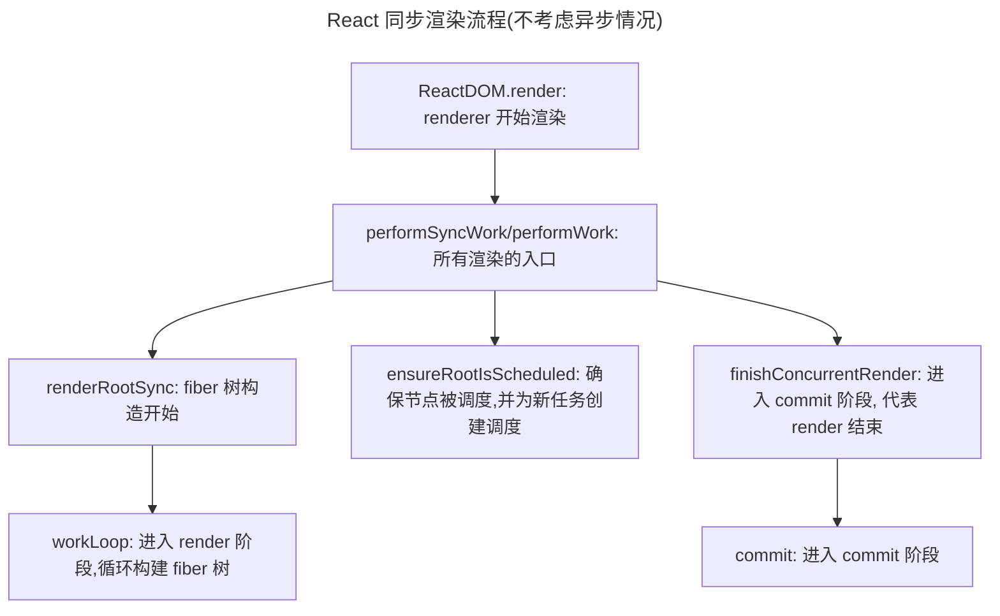

# React Fiber 构建

Fiber 可以说是 ***现代 React 中最为基础的部分***

Concurrent Mode 以及 许多特性都是基于 Fiber 架构而诞生的

> 本篇文章仅讨论 React 触发构建以及更新 VDOM 的逻辑
> 并不会详细讲解 diff 算法
> 有关 diff 的讲解位于 [React-Reconcile](../algo/React-Reconcile.md)

掌握好了 Fiber, 才算是掌握好了 React

Fiber 贯穿整个 React 渲染流程, 要了解 Fiber, 还得先来看看 React 的渲染流程

## React 渲染流程
作为一个开发者,得以窥探框架渲染过程的唯一契机就是性能监控面板

我也很推荐在阅读源码前去翻看性能监控,查看框架到底做了哪些事情

这比无头苍蝇的死磕源码要高效的多

:::tip[这是我观察 React 执行过程的流程:]

1. 首先随便打开一个项目（用`dev`模式，生产模式会被打包改名，不好辨认）

2. `F12`打开控制台，打开【性能】面板

3. 随便与页面交互一下，并用【性能】记录

4. 得到结果大致如下：

   

   其中绿色部分就是这个板块要研究的`React`渲染流程

   从图中我们可以提取到渲染流程如下：

   

:::

那我们顺着它往下走,从 `performSyncWorkOnRoot` 入手,观察 React 究竟干了什么 

## performSyncWorkOnRoot

源码如下：

```tsx
function performSyncWorkOnRoot(root: FiberRoot, lanes: Lanes) {
  // This is the entry point for synchronous tasks that don't go
  // through Scheduler.
  const didFlushPassiveEffects = flushPassiveEffects();
  if (didFlushPassiveEffects) {
    // If passive effects were flushed, exit to the outer work loop in the root
    // scheduler, so we can recompute the priority.
    return null;
  }
  if (enableProfilerTimer && enableProfilerNestedUpdatePhase) {
    syncNestedUpdateFlag();
  }
  const forceSync = true;
  performWorkOnRoot(root, lanes, forceSync);
}

```

这里通过`forceSync`强制`performWorkOnRoot`以同步方式工作

有同步，就有异步，而且通过这段代码就可以看出，在`React`中，更提倡的其实是异步的任务处理

而异步的任务处理，在`React`中，被称为`Concurrent`模式，与这里的区别在于`Scheduler`会介入，给任务排优先级，这个优先级被称为`lanes`，这在源码中会经常遇见，但是我们现在先不用管，先顺着较为简单的`sync`模式一步步摸索下去

:::note[卖个关子]
```tsx
const didFlushPassiveEffects = flushPassiveEffects();
```
这一行我们先不做解释，会在 [commit phase](./commitPhase/index.md) 详细讲解
:::

我们看看`performWorkOnRoot`干了什么

## performWorkOnRoot

我把代码简化了一下，大概分为以下几个阶段：

```tsx
// ...

let exitStatus = shouldTimeSlice
    ? renderRootConcurrent(root, lanes)
    : renderRootSync(root, lanes, true);

do {
  // 通过 exitStatus 检查 render 执行状态并决定应该继续还是结束
} while(true)

ensureRootIsScheduled();

// 完成渲染
finishConcurrentRender(root, exitStatus, finishedWork, lanes);
```

> 其中`shouldTimeSlice`就是是否应该启用`Concurrent`模式开启时间切片的意思


上述代码中:

- `renderRootSync`很好判断,即为渲染的主入口

- `finishConcurrentRender`也好理解,渲染结束的处理工作

- 然而 `ensureRootIsScheduled` 就没有这么容易揣测, **这个函数的作用是什么? 为什么需要这个函数?**

***稍安勿躁,我们一个一个来***

### renderRootSync

源码较长，但可大致分为如下部分:

```tsx
  // 栈帧处理,刷新栈帧
  if (workInProgressRoot !== root || workInProgressRootRenderLanes !== lanes) {
    if (enableUpdaterTracking) {
      if (isDevToolsPresent) {
        const memoizedUpdaters = root.memoizedUpdaters;
        if (memoizedUpdaters.size > 0) {
          restorePendingUpdaters(root, workInProgressRootRenderLanes);
          memoizedUpdaters.clear();
        }
        movePendingFibersToMemoized(root, lanes);
      }
    }

    workInProgressTransitions = getTransitionsForLanes(root, lanes);
    prepareFreshStack(root, lanes);
  }
  
  // wip 渲染挂起处理
  // 省略 switch 部分,不是本文重点
  
  // workloop执行，可能会被挂起
  workloopSync();
  // ...
  
  
  // 正常执行完毕
  if (workInProgress !== null) {
    // 渲染被挂起,保留当前渲染进度
   } else {
        // 正常情况下渲染完毕,清空 wip 树
      workInProgressRoot = null;
      workInProgressRootRenderLanes = NoLanes;

      // It's safe to process the queue now that the render phase is complete.
      finishQueueingConcurrentUpdates();
    }
```
实际上,主体逻辑只有一行: `workLoop`

:::info
在 [render phase](./renderPhase/beginWork.md) 中,我们会深入讨论这些
:::


### ensureRootIsScheduled
简化后代码如下:
```jsx
  // 创建 root 列表 
  if (root === lastScheduledRoot || root.next !== null) {
    // Fast path. This root is already scheduled.
    // 什么都不做,即复用当前已存在调度
  } else {
    if (lastScheduledRoot === null) {
      firstScheduledRoot = lastScheduledRoot = root;
    } else {
      lastScheduledRoot.next = root;
      lastScheduledRoot = root;
    }
  }
  // 如果不允许微任务调度
  // 调度 immediate 调度
  if (__DEV__ && ReactSharedInternals.actQueue !== null) {
    // We're inside an `act` scope.
    if (!didScheduleMicrotask_act) {
      didScheduleMicrotask_act = true;
      scheduleImmediateTask(processRootScheduleInMicrotask);
    }
  } else {
    if (!didScheduleMicrotask) {
      didScheduleMicrotask = true;
      scheduleImmediateTask(processRootScheduleInMicrotask);
    }
  }
  // 如果允许微任务调度就调度微任务
  if (!enableDeferRootSchedulingToMicrotask) {
    scheduleTaskForRootDuringMicrotask(root, now());
  }
```
该函数功能很简单, 会维护一个**root 列表**, 并为列表中任务增加调度.

那么这也从侧面说明, 该函数中的 root 不可能为整棵fiber树的root

实际上在这里,root就代表一个树节点, **react 每次调度树时都需要检查节点是否已经被调度, 如果有任务调度存在,则复用当前调度**

调度又分为`scheduleTaskForRootDuringMicrotask` 以及 `scheduleImmediateTask` 为具体调度函数:

在同步模式下,二者均只给 root 打上 `syncLane`

`schduleTaskForRootDuringMicrotask` 主要源码如下:
```jsx
  if (
    // 如果 lane 为同步
    // 并且未做 prerender
    includesSyncLane(nextLanes) &&
    !(enableSiblingPrerendering && checkIfRootIsPrerendering(root, nextLanes))
  ) {
    // 同步任务借助微任务执行
    // 而微任务会在一帧内被清空
    // 即任务一定会在当前帧执行完毕
    // 所以不需要 react 追踪执行状态
    // 也就不需要 scheduleCallback
    if (existingCallbackNode !== null) {
      cancelCallback(existingCallbackNode);
    }
    root.callbackPriority = SyncLane;
    root.callbackNode = null;
    return SyncLane;
  }
```
那么为什么需要 `ensureRootIsScheduled` 呢?

或者说这个函数有什么作用吗?

:::info[Andrew 的 commit 注释如下:]

> When React receives new input (via `setState`, a Suspense promise
resolution, and so on), it needs to ensure there's a rendering task
associated with the update. Most of this happens
`ensureRootIsScheduled`.
> If a single event contains multiple updates, we end up running the
scheduling code once per update. But this is wasteful because we really
only need to run it once, at the end of the event (or in the case of
flushSync, at the end of the scope function's execution).
> So this PR moves the scheduling logic to happen in a microtask instead.
In some cases, we will force it run earlier than that, like for
`flushSync`, but since updates are batched by default, it will almost
always happen in the microtask. Even for discrete updates.

> 翻译过来大概意思就是在 React 中有多种方式会触发组件更新，例如通过 setState、Suspense 的 promise 解析等。每当发生这些更新时，React 需要确保有一个 渲染任务 与更新相关联，这个渲染任务最终会被执行。ensureRootIsScheduled 是用来保证这个渲染任务被正确调度的函数。
> 
> 原来的架构中,多个更新任务的重复调度：如果一个事件（例如用户点击、输入等）包含多个状态更新，React 会针对每次更新都执行一次调度逻辑。这是浪费的，因为实际上我们只需要在事件的结束时（或 flushSync 调用结束时）执行一次调度任务，而不是每个 setState 调用都触发一次调度。
> 
> 这里采用 microtask 调用,确保在每个渲染任务的末尾调用更新即可,提高性能

:::

这个函数实际上有两个功能:
- 检查是否相关节点已经有更新在创建
- 为当前更新创建新任务

React 中的事件系统,依靠的就是 ensureRootIsScheduled, 调用新的更新

Concurrent 模式中, 任务可能被打断, 也是依靠 ensureRootIsScheduled 进行状态恢复


### finishConcurrentRender
该函数有很长的代码,但是主要逻辑只有一个: 进入 commit 阶段,将变更 fiber commit 到 dom 中
```jsx
let renderEndTime = 0;
  if (enableProfilerTimer && enableComponentPerformanceTrack) {
    // Track when we finished the last unit of work, before we actually commit it.
    // The commit can be suspended/blocked until we commit it.
    renderEndTime = now();
  }

  switch (exitStatus) {
    // ... 
    // 错误处理
  }

  // Only set these if we have a complete tree that is ready to be committed.
  // We use these fields to determine later whether or not the work should be
  // discarded for a fresh render attempt.
  root.finishedWork = finishedWork;
  root.finishedLanes = lanes;

  // 主要看 else 部分
  // 这里为 act 模式特殊处理
  if (shouldForceFlushFallbacksInDEV()) {
  } else {
    if (
      includesOnlyRetries(lanes) &&
      (alwaysThrottleRetries || exitStatus === RootSuspended)
    ) {
      // ...
      // retry 模式
      // 本人也不清楚
      // 之后研究明白再讲
    }
    // 普通模式下
    commitRootWhenReady(
      root,
      finishedWork,
      workInProgressRootRecoverableErrors,
      workInProgressTransitions,
      workInProgressRootDidIncludeRecursiveRenderUpdate,
      lanes,
      workInProgressDeferredLane,
      workInProgressRootInterleavedUpdatedLanes,
      workInProgressSuspendedRetryLanes,
      workInProgressRootDidSkipSuspendedSiblings,
      IMMEDIATE_COMMIT,
      renderStartTime,
      renderEndTime,
    );
  }
```

commit 的具体逻辑在 [commit-phase](./commitPhase/index.md)

在这一板块,我们先只关心 render 阶段,因此到此为止即可


## 小结
通过上述梳理,我们可以整理出完整的 React 渲染逻辑如下:



了解完大体流程后, 我们来深入了解 Fiber构建
本文对 Fiber 的介绍分为 三个板块
- [Fiber 构建 -- Render 阶段](./renderPhase/beginWork.md)
- [Fiber 构建 -- Commit 阶段](./commitPhase/index.md)
- [Reconcile 算法](../algo/React-Reconcile.md)
