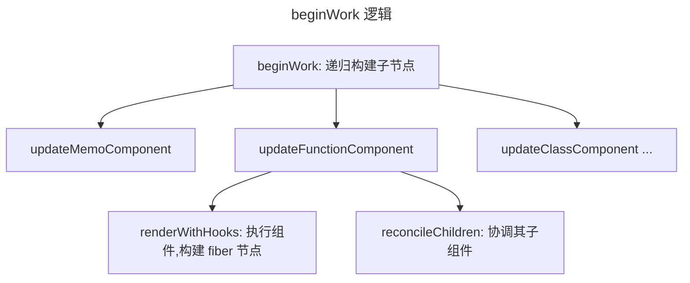
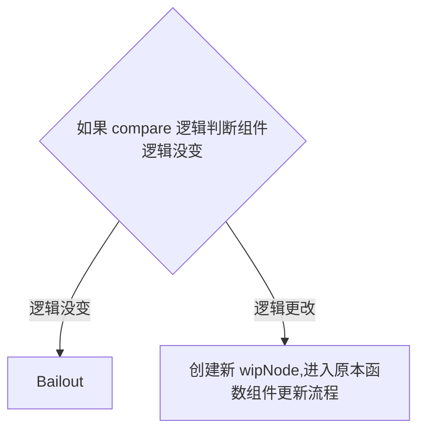

# BeginWork

从引言中截出 beginWork 逻辑,如下:

并且由引言得知,***beiginWork 会为节点新建 fiberNode***

那么本节就来深入代码层面探讨: ***它是如何做到这点的?***

还是从入口出发, 观察 `beginWork` 该函数都做了哪些工作

精简后代码如下:

## beginWork
```tsx
if (current !== null) {
    const oldProps = current.memoizedProps;
    const newProps = workInProgress.pendingProps;
    // 通过 didReceiveUpdate 确定组件是否需要更新
    // didReceiveUpdate 直接决定了组件是否需要重新渲染
    if (
      // 浅比较 props
      oldProps !== newProps ||
      hasLegacyContextChanged() ||
      // Force a re-render if the implementation changed due to hot reload:
      (__DEV__ ? workInProgress.type !== current.type : false)
    ) {
      // props 不同, 代表需要更新了
      didReceiveUpdate = true;
    } else {
      // 如果新旧 props 相同, 则检查是否已经被 scheduler 调度了
      // 如果被调度,则退出
      // 如果没被调度,则什么都不做
      // legacy mode 不做讨论
      const hasScheduledUpdateOrContext = checkScheduledUpdateOrContext(
        current,
        renderLanes,
      );
      if (
        !hasScheduledUpdateOrContext &&
        // If this is the second pass of an error or suspense boundary, there
        // may not be work scheduled on `current`, so we check for this flag.
        (workInProgress.flags & DidCapture) === NoFlags
      ) {
        // No pending updates or context. Bail out now.
        didReceiveUpdate = false;
        return attemptEarlyBailoutIfNoScheduledUpdate(
          current,
          workInProgress,
          renderLanes,
        );
      }
      if ((current.flags & ForceUpdateForLegacySuspense) !== NoFlags) {
        // This is a special case that only exists for legacy mode.
        // See https://github.com/facebook/react/pull/19216.
        didReceiveUpdate = true;
      } else {
        // An update was scheduled on this fiber, but there are no new props
        // nor legacy context. Set this to false. If an update queue or context
        // consumer produces a changed value, it will set this to true. Otherwise,
        // the component will assume the children have not changed and bail out.
        didReceiveUpdate = false;
      }
    }
  } else {
    // 创建 node 逻辑
    didReceiveUpdate = false;

    if (getIsHydrating() && isForkedChild(workInProgress)) {
      const slotIndex = workInProgress.index;
      const numberOfForks = getForksAtLevel(workInProgress);
      pushTreeId(workInProgress, numberOfForks, slotIndex);
    }
  }

  // 清除 wip 优先级
  workInProgress.lanes = NoLanes;

  // 根据 tag 更新组件
  switch (workInProgress.tag) {
    case LazyComponent: {
      const elementType = workInProgress.elementType;
      return mountLazyComponent(
        current,
        workInProgress,
        elementType,
        renderLanes,
      );
    }
    case FunctionComponent: {
      const Component = workInProgress.type;
      const unresolvedProps = workInProgress.pendingProps;
      const resolvedProps =
        disableDefaultPropsExceptForClasses ||
        workInProgress.elementType === Component
          ? unresolvedProps
          : resolveDefaultPropsOnNonClassComponent(Component, unresolvedProps);
      return updateFunctionComponent(
        current,
        workInProgress,
        Component,
        resolvedProps,
        renderLanes,
      );
    }
      // 以下省略200行的switch
```
:::info[有意思的一点是:]
这个函数包含了创建和更新的逻辑

这也是如下代码产生的原因

```js
current !== null && !didReceiveUpdate
```

当 current 存在,并且没有收到更新时,则代表需要 bailout
:::
简单来说，就是判断组件的新旧`prop`有没有更新，如果有更新，则根据组件的类型进入不同的分支

一般来说，我们的组件是`FunctionComponent`，但是如果用`React.memo`包一下，就会被当作是`MemoComponent`,这二者还是有很大不同的,我们待会就会讨论到这点

:::tip[`unresolvedProps`]
`unresolvedProps`简而言之，是传递给组件的原始属性，而 `resolvedProps` 是经过可能的默认属性解析后的属性集合。

**在大多数情况下，这两个集合是相同的**，除非组件是类组件且定义了 `getDefaultProps` 方法，或者使用了某些特定的 React 特性（如 `forwardRef` 或 `memo`）需要解析默认属性
:::

平常开发中,对于 `memo` 以及 `functionCompoent` 的使用频率最高
本文也以这两个函数作为例子,揭示 ***react 内部 是如何处理这二者的***

## updateFunctionComponent

其中最主要的一段如下：

```tsx
  let nextChildren;
  let hasId;
  prepareToReadContext(workInProgress, renderLanes);
  if (enableSchedulingProfiler) {
    markComponentRenderStarted(workInProgress);
  }
  // 省略 dev 模式
  // 调用 renderWithHooks 执行组件拿到更新后节点
  nextChildren = renderWithHooks(
    current,
    workInProgress,
    Component,
    nextProps,
    context,
    renderLanes,
  );
  hasId = checkDidRenderIdHook();
  if (enableSchedulingProfiler) {
    markComponentRenderStopped();
  }

  // 节点存在但没必要更新就 bailout
  // 这里的 didReceiveUpdate 即上文提到的标志
  // 是全局变量,猜测为优化性能设立
  if (current !== null && !didReceiveUpdate) {
    bailoutHooks(current, workInProgress, renderLanes);
    return bailoutOnAlreadyFinishedWork(current, workInProgress, renderLanes);
  }

  if (getIsHydrating() && hasId) {
    pushMaterializedTreeId(workInProgress);
  }

  // React DevTools reads this flag.
  workInProgress.flags |= PerformedWork;
  reconcileChildren(current, workInProgress, nextChildren, renderLanes);
  return workInProgress.child;
```

可以看到这里执行了两个比较重要的函数：`renderWithHooks`和`reconcileChildren`

`reconcileChildren`我们将会在 [React Reconcile](../../algo/React-Reconcile.md) 中详细解释

现在我们只需要知道这个函数是用来创建、更新 fiberNode,形成链表的即可 

### renderWithHooks
源码大概分为如下几个部分:
```jsx

  // ... ...
  // 重置 wip 节点残留状态
  workInProgress.memoizedState = null;
  workInProgress.updateQueue = null;
  workInProgress.lanes = NoLanes;

  // ... ...
  // 重置 Internals,标志进入组件阶段
  ReactSharedInternals.H =
      current === null || current.memoizedState === null
        ? HooksDispatcherOnMount
        : HooksDispatcherOnUpdate;

  // ... ...
  // 执行子组件
  let children = __DEV__
    ? callComponentInDEV(Component, props, secondArg)
    : Component(props, secondArg);
  shouldDoubleInvokeUserFnsInHooksDEV = false;

  // ... ...
  // 结束流程,做清理
  finishRenderingHooks(current, workInProgress, Component);

  return children;
```

:::info[清理工作]
finishRenderingHook 负责清理工作,会将 `ReactSharedInternals.H` 置空

而在使用 hook 时,回首先检查这个变量, 因此在组件以及 hook 外调用会产生报错

至于为什么必须在组件内使用 hook, 可以参考 [React Hooks](../../hooks/React-Hooks.md)

该函数执行子组件并返回,为后续的 [reconcile](../../algo/React-Reconcile.md) 做准备
:::


## updateMemoComponent
把 memo 放在 function 之后是我的小巧思
因为在 react 中, memo 对 function 做了简单封装
在某种情况下会通过 `didReceiveUpdate` 这一变量实现缓存效果
不可谓不妙
其主要逻辑如下:
```jsx
  // 是首次渲染
  if (current === null) {
    const type = Component.type;
    if (
      isSimpleFunctionComponent(type) &&
      Component.compare === null &&
      // SimpleMemoComponent codepath doesn't resolve outer props either.
      (disableDefaultPropsExceptForClasses ||
        Component.defaultProps === undefined)
    ) {
      // 此处省略内容为:修改 wip 上的组件类型
      // ...
      
      return updateSimpleMemoComponent(
        current,
        workInProgress,
        resolvedType,
        nextProps,
        renderLanes,
      );
    }
    if (!disableDefaultPropsExceptForClasses) {
      // 此处省略内容为 dev 逻辑
      // ...
    }
    const child = createFiberFromTypeAndProps(
      Component.type,
      null,
      nextProps,
      workInProgress,
      workInProgress.mode,
      renderLanes,
    );
    child.ref = workInProgress.ref;
    child.return = workInProgress;
    workInProgress.child = child;
    return child;
  }
  const currentChild = ((current.child: any): Fiber); // This is always exactly one child
  const hasScheduledUpdateOrContext = checkScheduledUpdateOrContext(
    current,
    renderLanes,
  );
  // 如果没有被调度则新建比较准备调度
  if (!hasScheduledUpdateOrContext) {
    const prevProps = currentChild.memoizedProps;
    // Default to shallow comparison
    let compare = Component.compare;
    // memo 允许传入 compare 函数
    // 其中 shallowEqual 为默认比较函数
    // 之所以称之为 shallow
    // 是因为只对 props对象比较一层
    // 剩余部分仍为浅比较
    compare = compare !== null ? compare : shallowEqual;
    if (compare(prevProps, nextProps) && current.ref === workInProgress.ref) {
      return bailoutOnAlreadyFinishedWork(current, workInProgress, renderLanes);
    }
  }
  // React DevTools reads this flag.
  workInProgress.flags |= PerformedWork;
  const newChild = createWorkInProgress(currentChild, nextProps);
  newChild.ref = workInProgress.ref;
  newChild.return = workInProgress;
  workInProgress.child = newChild;
  return newChild;
}
```
可以看到,主要逻辑分为两支, simpleMemoComponent 以及 MemoComponent

:::tip[区分的条件为`isSimpleFunctionComponent`]

它的源码如下:
```jsx
function shouldConstruct(Component: Function) {
  const prototype = Component.prototype;
  return !!(prototype && prototype.isReactComponent);
}

export function isSimpleFunctionComponent(type: any): boolean {
  return (
    typeof type === 'function' &&
    !shouldConstruct(type) &&
    type.defaultProps === undefined
  );
}
```
`simpleMemoComponent`逻辑其实很简单:
- 组件是真正的 function component（而不是 ES6 的 class component，因为使用 typeof 操作符对两者进行判断，结果都是 function ）；
- 用户进行 memoize 的时候，没有传递用于自定义逻辑的 compare 函数
- 组件函数上面没有定义 defaultProps。
:::

如果满足，我们就直接把当前的 workInProgress 的类型修正为 SimpleMemoComponent 类型，同时 workInProgress.type 指向组件函数本身。最后，从修正后的 workInProgress 重新开始，对它进行begin-work - 即调用 updateSimpleMemoComponent() helper 函数。如果不是,则进行 updateMemoComponent 

### updateSimpleComponent
updateSimpleMemoComponent() 的源码架构如下：
```jsx
  if (
      isSimpleFunctionComponent(type) &&
      Component.compare === null &&
      // SimpleMemoComponent codepath doesn't resolve outer props either.
      (disableDefaultPropsExceptForClasses ||
        Component.defaultProps === undefined)
    ) {
      // 此处省略内容为:修改 wip 上的组件类型
      // ...
      
      return updateSimpleMemoComponent(
        current,
        workInProgress,
        resolvedType,
        nextProps,
        renderLanes,
      );
    }
```
首次渲染的 `simpleFunction` 组件会被 React 内部转化为 `simpleMemoComponent`
使用的函数为 `updateSimpleMemoComponent`, 主要逻辑如下:
```jsx
  if (current !== null) {
    const prevProps = current.memoizedProps;
    if (
      shallowEqual(prevProps, nextProps) &&
      current.ref === workInProgress.ref &&
      // Prevent bailout if the implementation changed due to hot reload.
      (__DEV__ ? workInProgress.type === current.type : true)
    ) {
      didReceiveUpdate = false;

      workInProgress.pendingProps = nextProps = prevProps;

      if (!checkScheduledUpdateOrContext(current, renderLanes)) {
        // 这里保留源注释,因为我看不懂
        // The pending lanes were cleared at the beginning of beginWork. We're
        // about to bail out, but there might be other lanes that weren't
        // included in the current render. Usually, the priority level of the
        // remaining updates is accumulated during the evaluation of the
        // component (i.e. when processing the update queue). But since since
        // we're bailing out early *without* evaluating the component, we need
        // to account for it here, too. Reset to the value of the current fiber.
        // NOTE: This only applies to SimpleMemoComponent, not MemoComponent,
        // because a MemoComponent fiber does not have hooks or an update queue;
        // rather, it wraps around an inner component, which may or may not
        // contains hooks.
        // TODO: Move the reset at in beginWork out of the common path so that
        // this is no longer necessary.
        workInProgress.lanes = current.lanes;
        return bailoutOnAlreadyFinishedWork(
          current,
          workInProgress,
          renderLanes,
        );
      } else if ((current.flags & ForceUpdateForLegacySuspense) !== NoFlags) {
        // This is a special case that only exists for legacy mode.
        // See https://github.com/facebook/react/pull/19216.
        didReceiveUpdate = true;
      }
    }
  }
  return updateFunctionComponent(
    current,
    workInProgress,
    Component,
    nextProps,
    renderLanes,
  );
```
即如果`shallowEqual`相同,则代表 props 没有改变,`didReceiveUpdate`设为 false 执行 bailout
如果改变了,则会将该 flag 置为 true, 从而触发内部嵌套的原组件更新

### updateMemoComponent
该函数剩余逻辑如下:
```jsx
  const currentChild = ((current.child: any): Fiber); // This is always exactly one child
  const hasScheduledUpdateOrContext = checkScheduledUpdateOrContext(
    current,
    renderLanes,
  );
  if (!hasScheduledUpdateOrContext) {
    // This will be the props with resolved defaultProps,
    // unlike current.memoizedProps which will be the unresolved ones.
    const prevProps = currentChild.memoizedProps;
    // Default to shallow comparison
    let compare = Component.compare;
    compare = compare !== null ? compare : shallowEqual;
    if (compare(prevProps, nextProps) && current.ref === workInProgress.ref) {
      return bailoutOnAlreadyFinishedWork(current, workInProgress, renderLanes);
    }
  }
  // React DevTools reads this flag.
  workInProgress.flags |= PerformedWork;
  const newChild = createWorkInProgress(currentChild, nextProps);
  newChild.ref = workInProgress.ref;
  newChild.return = workInProgress;
  workInProgress.child = newChild;
```
如果传入了 compare 函数或者传入了 defaultProps,则会进入到这段逻辑:

- 如果 compare 逻辑验证组件与之前相同,则 bailout
- 否则 创建新 workInProgress 节点
此后的流程均与普通 update 相同

> 至于为什么需要将 `Memo` 分为 `SimpleMemoComponent` 和 `MemoComponent`
> 个人也不是很理解
> 猜测可能为节省对于 compare 以及 defaultProps 的判断逻辑

## 小结
beginWork 的主要逻辑只有一行: `Component(....)`

***它最重要的任务就是执行组件,并且根据组件的状态判断是否需要更新或者挂载***

在这个阶段,组件被运行,状态被挂载,似乎一切都很顺利

但是还有个很大的隐患: ***这里的状态均保存在组件内部,需要找出要更新的组件,就需要再次遍历整棵树,这个操作是十分耗时的,那么react是怎么处理的呢?***

让我们继续 completeWork 阶段的解读

看看 React 的真实想法是什么吧