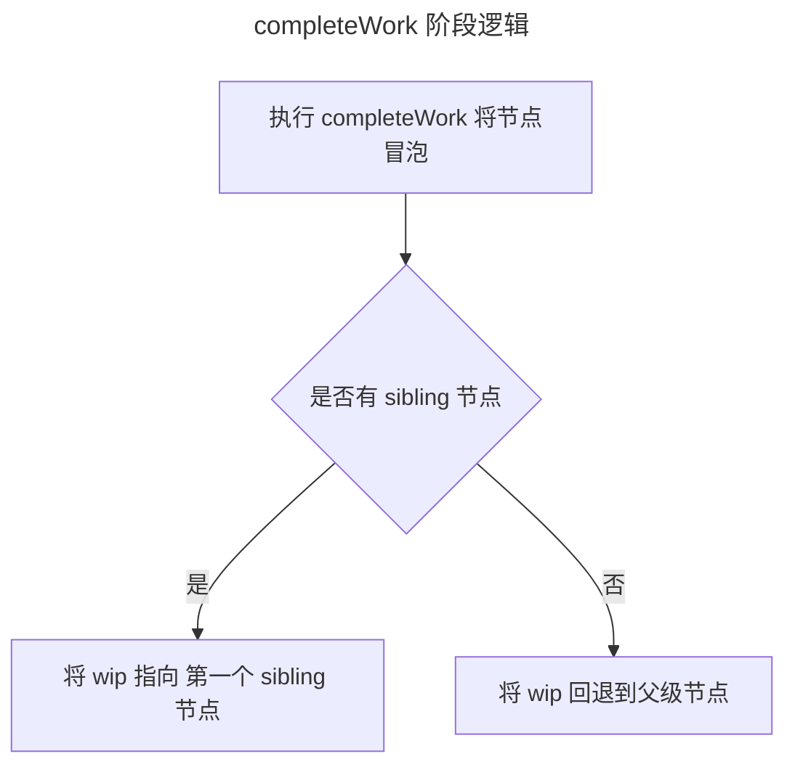
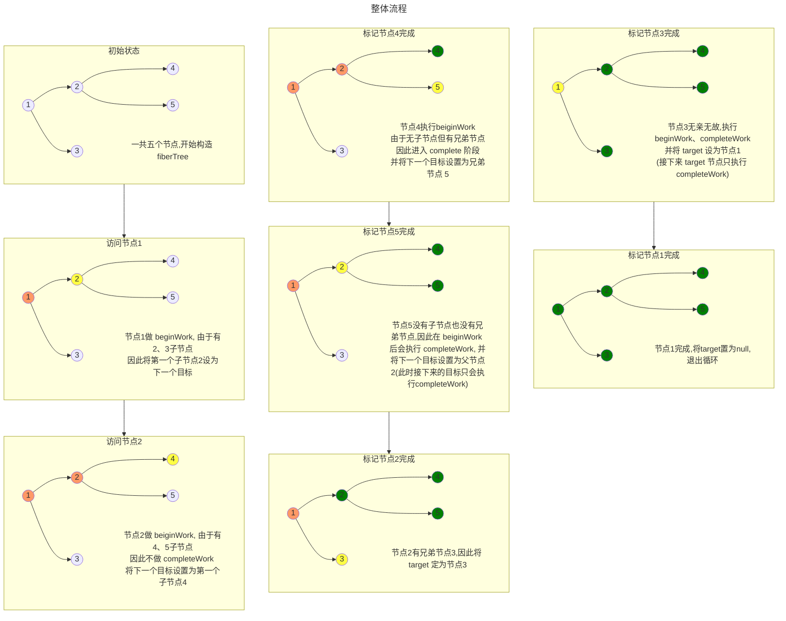
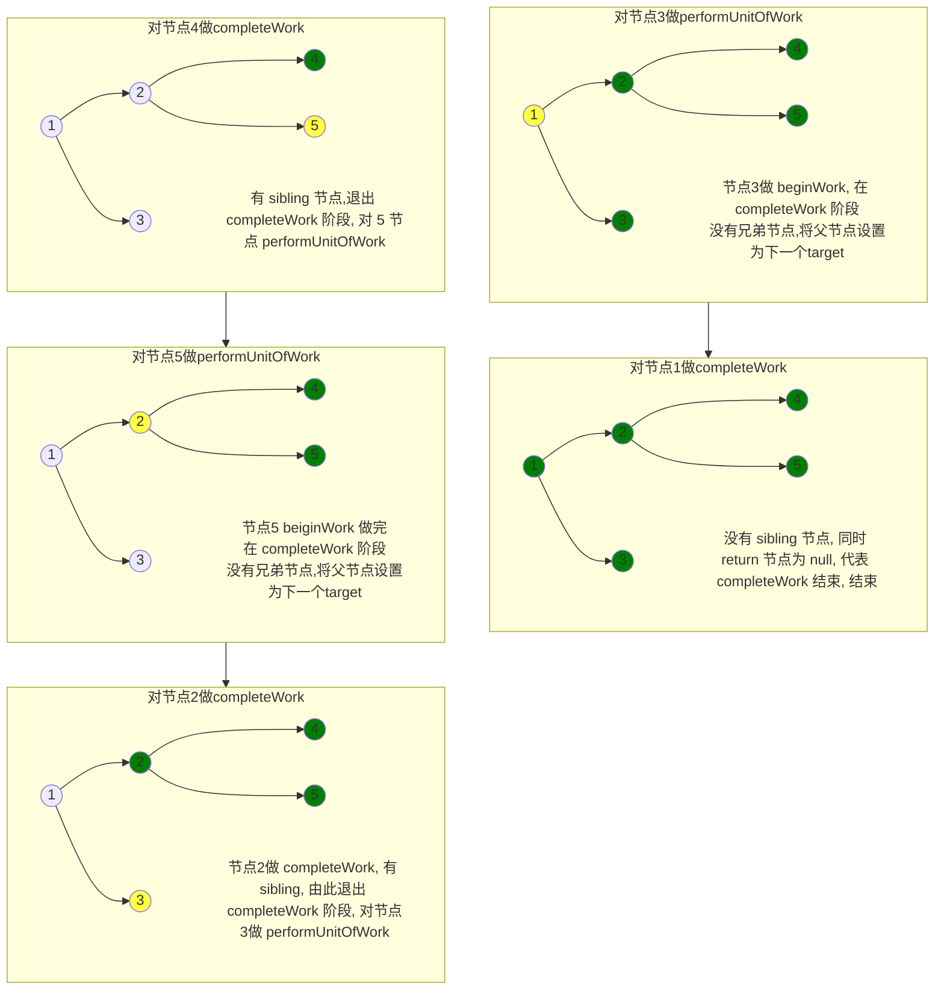

# CompleteWork

在结束了 beginWork 之后,代表该节点已经是子树中最深的节点

换句话说,该棵子树已经遍历到底部了,是时候拓展广度了

接下来的工作很简单: ***寻找到下一个需要构建的兄弟节点,对它进行 beginWork,直到构建出一整棵树***

流程大概如下:


## completeUnitOfWork

主要结构为如下循环:
```jsx
do {
    const current = completedWork.alternate;
    const returnFiber = completedWork.return;
    // ...
    // 此处省略 profiler mode
    next = completeWork(current, completedWork, entangledRenderLanes);
     if (next !== null) {
      // Completing this fiber spawned new work. Work on that next.
      workInProgress = next;
      return;
    }

    const siblingFiber = completedWork.sibling;
    if (siblingFiber !== null) {
      // If there is more work to do in this returnFiber, do that next.
      workInProgress = siblingFiber;
      return;
    }
    // Otherwise, return to the parent
    // $FlowFixMe[incompatible-type] we bail out when we get a null
    completedWork = returnFiber;
    // Update the next thing we're working on in case something throws.
    workInProgress = completedWork;
} while (completedWork !== null);
```

逻辑很简单:

1. 如果当前 `completeWork` 产生了新的节点任务,那么退出当前 `completeWork` 阶段, 对新节点重新 `performUnitOfWork`
2. 如果该节点 `completeWork` 做完,还有兄弟节点,也结束当前 `completeWork` 阶段, 则继续对兄弟节点做 `performUnitOfWork`
3. 如果没有兄弟节点,则将下一个`completeWork`的对象设置为父节点,直到到达根节点(`returnFiber === completeWork`)

:::info[串联一下]
***这一部分也是 react 遍历的时候能够回溯的原因***

了解过 beginWork 与 completeUnitOfWork 之后, 会发现原来那幅图的实现依靠的是两个循环:



- **第一个循环**: 最外层的 workloop, ***负责深度优先遍历***, 对每个组件做 beginWork, 创建 fiber 树, 找到最深的节点
- **第二个循环**: completeWork 循环, ***负责广度优先遍历以及回溯***, 对每一个组件做 completeUnitOfWork, 并确定应该回溯的节点,直到回到根节点

然而 completeWork 的工作不止于此, 我们深入到代码层面观察 completeWork 的工作
:::

## completeWork

代码主题内容如下:
```jsx
    case IncompleteFunctionComponent: {
      if (disableLegacyMode) {
        break;
      }
      // Fallthrough
    }
    case LazyComponent:
    case SimpleMemoComponent:
    case FunctionComponent:
    case ForwardRef:
    case Fragment:
    case Mode:
    case Profiler:
    case ContextConsumer:
    case MemoComponent:
      bubbleProperties(workInProgress);
      return null;
```

在大多数情况下,只会执行 `bubbleProperties` 一个函数

## bubbleProperties

```jsx
    let child = completedWork.child;
      while (child !== null) {
        newChildLanes = mergeLanes(
          newChildLanes,
          mergeLanes(child.lanes, child.childLanes),
        );

        subtreeFlags |= child.subtreeFlags;
        subtreeFlags |= child.flags;

        // Update the return pointer so the tree is consistent. This is a code
        // smell because it assumes the commit phase is never concurrent with
        // the render phase. Will address during refactor to alternate model.
        child.return = completedWork;

        child = child.sibling;
      }
```

:::tip[fiber flag]
在讲解代码作用之前,我们先了解一下代码中的 flag, flag 是 react 中代表节点操作类型的标志,有以下几种值:

- Placement（插入）
- Update（更新）
- Deletion（删除）
- Ref（引用更新）
- Callback（回调）
:::

在代码中, react 将子节点的 child flag 添加到父节点中,这是一个很奇妙的操作,我们来详细讲解一下

## bubblePropperties

先来考虑没有 flag 的情况: 在更新时, react 不知道哪个节点需要更新, 需要遍历一整棵树,并且需要依次对比 baseProps 以及 baseState 才能得出结果,这样操作十分费时

那 react 这种做法,起到的就是 ***剪枝*** 的效果: 

**父节点中的 flag 包含子节点的 flag, 那么寻找子树中是否需要更新时可以直接判断 flag 中包不包含 placement 等操作,如果不包含就舍弃遍历子树**

## completeUnitOfWork 概览

