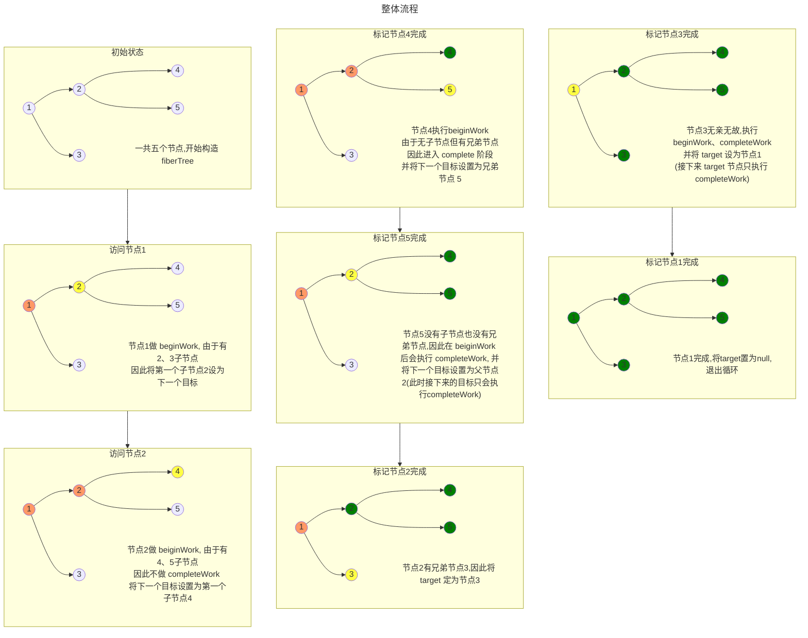
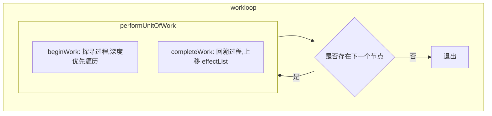
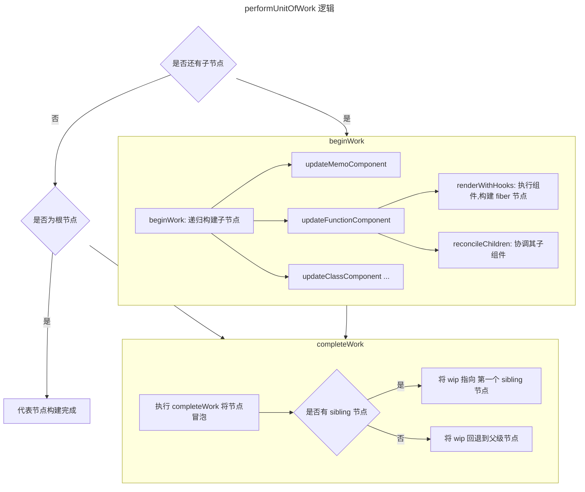

# Render 阶段
之前提到, `renderRootSync` 会调用 `workloop`

在本章,我们会深入理解 `workloop` 究竟做了什么工作

但是首先,我们先了解一下`workloop`的大致逻辑流程,这对我们深入代码层面很有帮助

:::info[workloop 流程]

:::

## workloop/performUnitOfWork

`workloop`很纯粹，循环`workInProgress`应用更改

```tsx
function workLoopSync() {
  // Perform work without checking if we need to yield between fiber.
  while (workInProgress !== null) {
    performUnitOfWork(workInProgress);
  }
}
```

`performUnitOfWork`中可以看到两个在[前备知识](../intro/index.md)中熟悉的身影:`beginWork`和`completeWork`

从此处开始，更新粒度深入为`fiberNode`级别

```tsx
  // current 树上节点
  // 通过 wip 的 alternate 指向
  const current = unitOfWork.alternate;

  let next;
  // 除去 dev 以及 profiler 逻辑
  // 主体逻辑仅有一行
  // 对当前节点做 beginWork
  // beginWork 返回下一个节点
  next = beginWork(current, unitOfWork, entangledRenderLanes);

  if (!disableStringRefs) {
    resetCurrentFiber();
  }
  unitOfWork.memoizedProps = unitOfWork.pendingProps;
  if (next === null) {
    // 如果后续没有节点,代表本节点的 unitWork 完成
    // 调用 completeWork 进入下一阶段
    completeUnitOfWork(unitOfWork);
  } else {
    workInProgress = next;
  }
```
其中 `beginWork` 即为 beginWork 阶段入口
`completeUnitOfWork` 即为 completeWork 阶段入口

## 小结
在本节中,我们分析了 `workloop`的结构

并将渲染流程分为 `beginWork` 以及 `completeWork`阶段

结构如下:

:::info[主要函数为 `performUnitOfWork`, 这也是本篇的重点 ]

整理出其具体流程如下,可在阅读完本章内容后回头阅读本图,相信会有不同收获:

:::

那么就让我们趁热打铁,看看 [beiginWork](./beginWork.md) 中, React 都做了哪些工作吧
